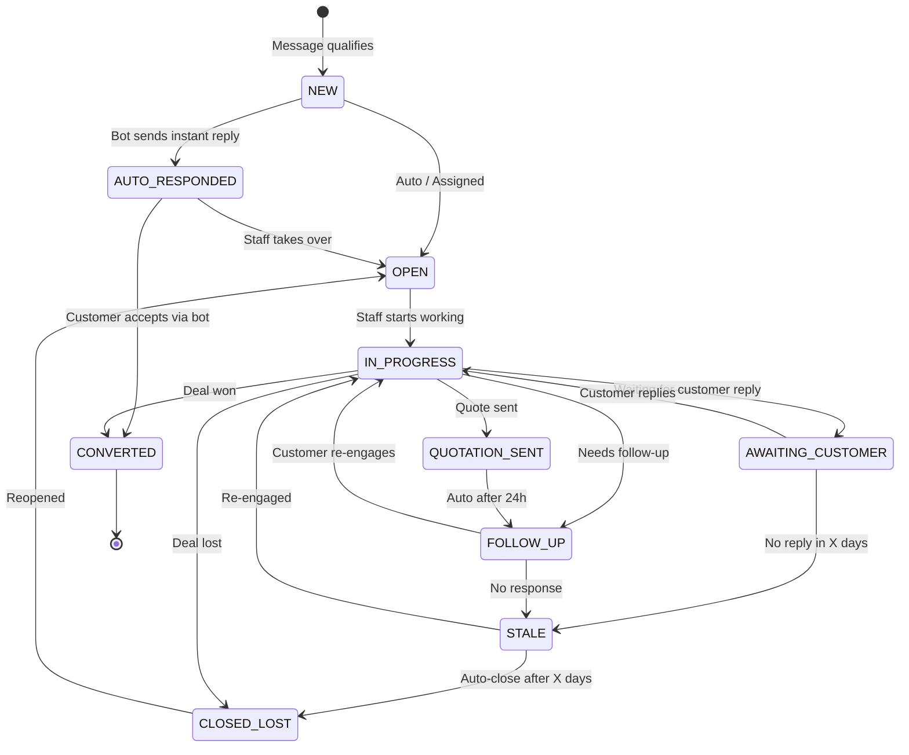

# 🏗️ Ultimate Enquiry System — The Complete Blueprint

> This document answers: "If you had to design the **best enquiry system of all time**, what would it look like?" It covers every scenario — same person across channels, conversation threading, reply routing, contact merging, and future-proof enterprise features.

---

## Table of Contents

1. [The Core Problem with the Current System](#the-core-problem)
2. [The 5 Pillars of an Ultimate Enquiry System](#five-pillars)
3. [Pillar 1: Unified Contact Identity](#pillar-1)
4. [Pillar 2: Conversation Threading](#pillar-2)
5. [Pillar 3: Omnichannel Reply Routing](#pillar-3)
6. [Pillar 4: Intelligent Enquiry Lifecycle](#pillar-4)
7. [Pillar 5: Enterprise Features](#pillar-5)
8. [What to REMOVE from the Current System](#what-to-remove)
9. [Complete Data Model (Visual)](#data-model)
10. [Workflow Walkthrough: Real Scenarios](#workflows)
11. [Feature Matrix: Must-Have vs Advanced](#feature-matrix)
12. [Deployment Strategy: What to Build When](#deployment-phases)

---

<a id="the-core-problem"></a>
## 🚨 The Core Problem with the Current System

Your current system has a **fatal flaw**: it treats every inbound message as an isolated event that creates a separate enquiry. This breaks in these real-world scenarios:

### Scenario 1: Same Person, Second Message
> **Rahul** sends a WhatsApp message: "What are the admission fees?"
> → Enquiry #1 created ✅
> **Rahul** sends another WhatsApp message: "Also, is there transport available?"
> → Enquiry #2 created ❌ **This should be part of the SAME conversation!**

### Scenario 2: Same Person, Different Channel
> **Priya** sends WhatsApp message: "I want admission for my son"
> → Enquiry #1 created (phone: +91-98765...) ✅
> **Priya** sends email: "Following up on admission query"
> → Enquiry #2 created (email: priya@...) ❌ **This is the SAME PERSON asking about the SAME TOPIC!**

### Scenario 3: Replying Back
> Staff member wants to reply to Rahul's enquiry.
> **Current system**: Stores a `ConversationMessage` in DB, but doesn't actually send it anywhere.
> **Ideal system**: Should send the reply via the SAME channel (WhatsApp → WhatsApp reply, Email → Email reply).

### Scenario 4: Multi-Channel Conversation
> Student parent sends initial query on WhatsApp → gets a reply → sends follow-up via email → staff needs to see the FULL conversation across both channels in ONE place.

### Why This Happens
The current system's data model is:
```
InboundMessage (1) ──→ (1) Enquiry ──→ (many) ConversationMessages
```
This 1:1 relationship between InboundMessage and Enquiry means **every new message = new enquiry**. There's no concept of a **Contact** (person) or **Conversation** (ongoing thread).

---

<a id="five-pillars"></a>
## 🏛️ The 5 Pillars of an Ultimate Enquiry System

```mermaid
graph TD
    A["🏛️ Ultimate Enquiry System"] --> B["👤 Unified Contacts"]
    A --> C["💬 Conversation Threading"]
    A --> D["📡 Omnichannel Routing"]
    A --> E["🔄 Intelligent Lifecycle"]
    A --> F["🏢 Enterprise Features"]
    
    B --> B1["Identity Resolution"]
    B --> B2["Contact Merging"]
    B --> B3["Channel Registry"]
    
    C --> C1["Same-person detection"]
    C --> C2["Cross-channel threading"]
    C --> C3["Topic grouping"]
    
    D --> D1["Reply via same channel"]
    D --> D2["Channel preferences"]
    D --> D3["Delivery tracking"]
    
    E --> E1["Smart auto-assignment"]
    E --> E2["SLA management"]
    E --> E3["Follow-up automation"]
    
    F --> F1["Multi-tenant"]
    F --> F2["Analytics & Reports"]
    F --> F3["Webhooks & Integrations"]
```



---

<a id="pillar-1"></a>
## 👤 Pillar 1: Unified Contact Identity

> **The biggest missing piece.** Before you can thread conversations, you need to know WHO is talking to you — even if they use different channels.

### The Concept: A "Contact" is a Person, Not a Phone Number

Currently we store `phone` and `email` directly on the Enquiry. Instead, we introduce a **Contact** entity that holds all known identifiers for a person:

```
┌─────────────────────────────────────────┐
│              Contact                     │
│  id: uuid                                │
│  displayName: "Rahul Sharma"             │
│  ─────────────────────────────────       │
│  channels:                               │
│    ├─ WHATSAPP: +91-9876543210          │
│    ├─ EMAIL: rahul@gmail.com            │
│    └─ EMAIL: rahul@company.com          │
│  ─────────────────────────────────       │
│  enquiries: [Enquiry #1, Enquiry #2]    │
│  totalEnquiries: 2                       │
│  firstSeenAt: 2024-01-15                │
│  lastSeenAt: 2024-03-20                 │
└─────────────────────────────────────────┘
```

### How Identity Resolution Works

When a new message arrives:

```
New message from +91-9876543210 (WhatsApp)
                │
                ▼
    ┌── Step 1: Look up ContactChannel ──┐
    │  SELECT contact FROM contact_channel│
    │  WHERE channel = 'WHATSAPP'         │
    │  AND identifier = '+91-9876543210'  │
    └─────────────────────────────────────┘
                │
        ┌───────┴───────┐
        │               │
    Found?           Not found?
        │               │
        ▼               ▼
  Return existing    Create new Contact
  Contact            + ContactChannel
        │               │
        └───────┬───────┘
                │
                ▼
    ┌── Step 2: Check for existing ──────┐
    │  open enquiry for this Contact      │
    │  (within the same topic/thread)     │
    └─────────────────────────────────────┘
                │
        ┌───────┴───────┐
        │               │
    Existing          No existing
    open enquiry?     open enquiry
        │               │
        ▼               ▼
  Append message     Create new Enquiry
  to existing        for this Contact
  enquiry
```

### Contact Merging (Cross-Channel)

When the **same person** messages from a new channel:

```
Scenario: Rahul (known via WhatsApp) now sends email from rahul@gmail.com

Step 1: No ContactChannel found for "rahul@gmail.com"
Step 2: AI/Rule checks message content for references to existing enquiry
Step 3: Staff can manually merge: "This email is from the same person as Contact #xyz"
Step 4: Both channels now linked to same Contact

        ┌───────────────────┐
        │   Contact: Rahul  │
        │   ────────────    │
        │   WhatsApp: +91...│ ← already known
        │   Email: rahul@...│ ← newly linked
        └───────────────────┘
```

### Auto-Merge Signals (Heuristics)

The system can **suggest** merges automatically when:

| Signal | Confidence | Example |
|--------|------------|---------|
| Same phone in email signature | 🟢 High | Email body contains "+91-9876543210" |
| Same name (fuzzy match) | 🟡 Medium | "Rahul Sharma" vs "R. Sharma" |
| Same IP address (web form) | 🟡 Medium | Two form submissions, same IP |
| AI detects same context | 🟡 Medium | "Following up on my WhatsApp query about admission" |
| Staff confirms manually | 🟢 Definite | Drag-and-drop merge in UI |

---

<a id="pillar-2"></a>
## 💬 Pillar 2: Conversation Threading

> **Core question**: When a known person sends a new message, should it create a new enquiry or append to an existing one?

### The Rules

```
New qualified message from Contact X arrives
                │
                ▼
    ┌── Is there an OPEN enquiry ────────┐
    │  for this Contact?                  │
    │  (status NOT in: CONVERTED,         │
    │   CLOSED_LOST, REVIEWED_REJECTED)   │
    └─────────────────────────────────────┘
                │
        ┌───────┴───────┐
        │               │
       YES              NO
        │               │
        ▼               ▼
    ┌── Is the topic ──┐  Create NEW
    │  the same?       │  Enquiry
    └──────────────────┘
        │
   ┌────┴────┐
   │         │
  SAME    DIFFERENT
  TOPIC   TOPIC
   │         │
   ▼         ▼
 APPEND    Create NEW
 to existing   Enquiry
 enquiry      (link same Contact)
```

### How "Same Topic" is Determined

| Method | How | Example |
|--------|-----|---------|
| **Time window** | Message within 48h of last activity on open enquiry | Rahul messaged 2h ago about admission → new message about admission → same thread |
| **Keyword overlap** | >40% keyword overlap with existing enquiry | "transport fees" → existing enquiry about "fees and transport" → same thread |
| **Explicit reference** | "Regarding my previous query", "As discussed" | Auto-detected by rules/AI |
| **Channel reply** | WhatsApp reply to existing conversation (message threading) | WhatsApp has `context.message_id` in replies |
| **Email threading** | `In-Reply-To` / `References` header matches | Standard email threading |
| **Default** | If unsure, append to most recent open enquiry | Configurable: append vs create-new |

### What the Data Model Looks Like

```
┌──────────────────────────────────────────────────┐
│                   Contact                         │
│  Rahul Sharma                                     │
│  WhatsApp: +91-9876543210                        │
│  Email: rahul@gmail.com                           │
│                                                   │
│  ┌──── Enquiry #1 (Admission) ───────────────┐  │
│  │  Status: OPEN                              │  │
│  │  Created: Jan 15                           │  │
│  │                                            │  │
│  │  Messages (chronological):                 │  │
│  │   [WA] "What are admission fees?"    ←─────│──│── Jan 15
│  │   [WA] "Also transport available?"   ←─────│──│── Jan 15 (appended!)
│  │   [EM] "Sending my docs, see attached" ←───│──│── Jan 17 (cross-channel!)
│  │   [WA] ← Staff reply: "Fees are..."  ─────│──│── Jan 17 (outbound)
│  └────────────────────────────────────────────┘  │
│                                                   │
│  ┌──── Enquiry #2 (Transport-only) ──────────┐  │
│  │  Status: OPEN                              │  │
│  │  Created: Mar 20                           │  │
│  │                                            │  │
│  │  Messages:                                 │  │
│  │   [WA] "Need bus route for sector 45" ←────│──│── Mar 20 (new topic!)
│  └────────────────────────────────────────────┘  │
└──────────────────────────────────────────────────┘
```

---

<a id="pillar-3"></a>
## 📡 Pillar 3: Omnichannel Reply Routing

> **The question**: When staff replies to an enquiry, WHERE does the reply go?

### Reply Channel Selection Logic

```
Staff clicks "Reply" on Enquiry #1
                │
                ▼
    ┌── Determine reply channel ─────────┐
    │                                     │
    │  Option A: Auto (Smart Routing)     │
    │  → Reply via the SAME channel the   │
    │    customer last used                │
    │                                     │
    │  Option B: Manual (Staff Chooses)   │
    │  → Dropdown: WhatsApp / Email / SMS │
    │                                     │
    │  Option C: Preferred Channel        │
    │  → Contact has a preferred channel  │
    │    set in their profile             │
    └─────────────────────────────────────┘
                │
                ▼
    ┌── Send via integration ────────────┐
    │                                     │
    │  WhatsApp → WhatsApp Business API   │
    │  Email    → SendGrid / SES / SMTP   │
    │  SMS      → Twilio / MSG91          │
    └─────────────────────────────────────┘
                │
                ▼
    ┌── Track delivery ──────────────────┐
    │  Status: SENT → DELIVERED → READ   │
    │  Store externalId for reference     │
    └─────────────────────────────────────┘
```

### Outbound Message Flow

```
┌─────────────────────────────────────────────────────────┐
│                    Outbound Pipeline                     │
│                                                          │
│  Staff types reply                                       │
│       │                                                  │
│       ▼                                                  │
│  ConversationMessage created (direction: OUTBOUND)       │
│       │                                                  │
│       ▼                                                  │
│  ┌── Channel Router ──────────────────────────────┐     │
│  │  Picks: WhatsApp / Email / SMS based on logic  │     │
│  └────────────────────────────────────────────────┘     │
│       │                                                  │
│       ▼                                                  │
│  ┌── Provider Adapter ────────────────────────────┐     │
│  │  WhatsAppAdapter.send(to, message)              │     │
│  │  EmailAdapter.send(to, subject, body)           │     │
│  │  SMSAdapter.send(to, message)                   │     │
│  └────────────────────────────────────────────────┘     │
│       │                                                  │
│       ▼                                                  │
│  Update ConversationMessage:                             │
│    deliveryStatus: SENT                                  │
│    externalId: "wamid_abc123"                            │
│       │                                                  │
│       ▼                                                  │
│  Webhook callback (async):                               │
│    deliveryStatus: DELIVERED → READ                      │
└─────────────────────────────────────────────────────────┘
```

### Channel Adapters (Plugin Architecture)

Each channel (WhatsApp, Email, SMS) is a separate adapter implementing a common interface:

```
interface ChannelAdapter {
  channel: MessageChannel;
  send(params: { to: string; content: string; subject?: string }): Promise<{ externalId: string }>;
  getDeliveryStatus(externalId: string): Promise<DeliveryStatus>;
}

// Implementations:
WhatsAppAdapter   → calls WhatsApp Business API
EmailAdapter      → calls SendGrid/SES API
SMSAdapter        → calls Twilio/MSG91 API
WebChatAdapter    → pushes to WebSocket (future)
```

---

<a id="pillar-4"></a>
## 🔄 Pillar 4: Intelligent Enquiry Lifecycle

### Enhanced Status Machine



### Smart Auto-Assignment

```
New enquiry arrives
        │
        ▼
  ┌─────────────────────────────────────┐
  │  Assignment Strategy (configurable)  │
  │                                      │
  │  1. Round-robin (default)            │
  │     → Next available staff member    │
  │                                      │
  │  2. Skill-based                      │
  │     → Match enquiry.intent to        │
  │       staff skills                    │
  │     → ADMISSION → Admission team     │
  │     → FEE → Finance team             │
  │                                      │
  │  3. Load-balanced                    │
  │     → Staff with fewest open enquiries│
  │                                      │
  │  4. Previous assignee                │
  │     → If Contact had a previous      │
  │       enquiry, assign to same staff  │
  │       for relationship continuity    │
  │                                      │
  │  5. Territory-based                  │
  │     → Based on sender's location     │
  └─────────────────────────────────────┘
```

### SLA Management

| SLA Rule | Trigger | Action |
|----------|---------|--------|
| **First Response Time** | New enquiry not responded in 30 min | Notify assigned staff + manager |
| **Resolution Time** | Enquiry open > 48h | Escalate to senior team |
| **Customer Wait Time** | Customer replied, no staff response in 2h | Alert + re-assign |
| **Stale Enquiry** | No activity for 7 days | Auto-transition to STALE |
| **Auto-Close** | STALE for 14 days | Auto-close as CLOSED_LOST |
| **Breach Notification** | Any SLA breached | Email + Dashboard notification |

### Follow-Up Automation

```
Enquiry moves to QUOTATION_SENT
        │
        ▼
  Schedule: Follow-up in 24h
        │
        ▼ (24h later, no customer reply)
  Auto-send: "Hi [Name], following up on the quote we sent..."
        │
        ▼
  Schedule: Follow-up in 72h
        │
        ▼ (72h later, still no reply)
  Auto-send: "Just checking in — let us know if you have questions"
        │
        ▼
  Schedule: Mark as STALE in 7 days
        │
        ▼ (7 days, no reply)
  Status → STALE
  Notify staff: "Enquiry #X is going cold"
```

---

<a id="pillar-5"></a>
## 🏢 Pillar 5: Enterprise Features

### 5.1 Canned Responses / Templates

Pre-written responses that staff can insert with one click:

```
Templates:
  ├── Admission
  │    ├── "Welcome! Admission fees for Class {class} are..."
  │    ├── "Required documents for admission: ..."
  │    └── "Admission process: Step 1..."
  ├── Fees
  │    ├── "Fee structure for {year}: ..."
  │    └── "Payment modes accepted: ..."
  ├── Transport
  │    ├── "Bus routes available: ..."
  │    └── "Transport fees: ..."
  └── General
       ├── "Thank you for your interest! ..."
       └── "Our office hours are..."
```

Variables like `{name}`, `{class}`, `{fee_amount}` auto-fill from Contact/Enquiry data.

### 5.2 Internal Notes

Staff can add private notes visible only to the team (not sent to customer):

```
Enquiry Timeline:
  10:00 AM  [INBOUND] "What are fees for Class 5?" — via WhatsApp
  10:05 AM  [NOTE] @staff: "Parent seems interested, mentioned budget constraint" ← Internal
  10:10 AM  [OUTBOUND] "Thank you! Class 5 fees are..." — via WhatsApp
  10:30 AM  [NOTE] @manager: "Offer 5% discount if they confirm today" ← Internal
```

### 5.3 Tagging & Categorisation

```
Auto-Tags (from AI):
  • high-value (budget > ₹1L)
  • urgent (timeline < 1 week)
  • returning-parent (known Contact with history)
  • bulk-admission (multiple children)

Manual Tags (from staff):
  • vip
  • scholarship-eligible
  • referred-by-trustee
  • needs-callback
```

### 5.4 Analytics & Reports

| Report | What It Answers |
|--------|-----------------|
| **Channel Distribution** | Which channels bring the most enquiries? |
| **Response Time** | How fast is our team? SLA breach rate? |
| **Conversion Funnel** | NEW → OPEN → QUOTATION → CONVERTED % |
| **Staff Performance** | Enquiries handled per person, avg resolution time |
| **Intent Breakdown** | What are people asking about most? |
| **Peak Hours** | When do most enquiries come in? (staffing decisions) |
| **AI vs Rule** | How many resolved by rules vs AI? Cost per classification? |
| **Contact Lifecycle** | How many enquiries does an average contact create? |
| **Channel Effectiveness** | Which channel has highest conversion rate? |
| **Lost Reasons** | Why are enquiries being closed as lost? |

### 5.5 Webhooks & External Integrations

Allow third-party systems to subscribe to events:

```
Events available for webhook subscription:
  • enquiry.created
  • enquiry.assigned
  • enquiry.status_changed
  • enquiry.converted
  • enquiry.closed
  • contact.created
  • contact.merged
  • message.inbound
  • message.outbound
  • sla.breached
```

### 5.6 Role-Based Views

| Role | What They See |
|------|---------------|
| **Sales Staff** | Only their assigned enquiries |
| **Team Lead** | Their team's enquiries + unassigned queue |
| **Manager** | All enquiries + analytics dashboard |
| **Admin** | Everything + rule management + system settings |

### 5.7 AI-Powered Features (Advanced)

| Feature | Description |
|---------|-------------|
| **Auto-Reply** | Bot sends instant contextual reply for common questions |
| **Reply Suggestions** | AI suggests 3 possible responses, staff picks one |
| **Sentiment Analysis** | Detect frustrated/happy/neutral tone, flag frustrated ones |
| **Language Detection + Translation** | Auto-translate Hindi/regional messages for English-speaking staff |
| **Smart Summary** | AI generates a 2-line summary of long conversations |
| **Duplicate Detection** | Detect and flag similar enquiries for merging |
| **Priority Prediction** | AI predicts likelihood of conversion → auto-prioritise |

---

<a id="what-to-remove"></a>
## 🗑️ What to REMOVE from the Current System

| To Remove | Why | Replace With |
|-----------|-----|-------------|
| 1:1 `InboundMessage → Enquiry` link | Forces one enquiry per message | Contact-based threading |
| `phone` and `email` directly on Enquiry | No contact identity | `Contact` model with channels |
| `ConversationMessage` without delivery tracking | Messages stored but never actually sent | Outbound pipeline with channel adapters |
| Hardcoded `PROCESSING` status on InboundMessage | No `AWAITING_CUSTOMER`, `STALE` states | Enhanced state machine |
| Manual-only assignment | No auto-assignment | Smart assignment strategies |
| No SLA tracking | No accountability | Time-based SLA engine |

---

<a id="data-model"></a>
## 📊 Complete Data Model (Visual)

```
┌───────────────────────────────────────────────────────────────────┐
│                         NEW DATA MODEL                            │
│                                                                   │
│  ┌──────────────┐       ┌──────────────────┐                     │
│  │   Contact     │──1:N──│  ContactChannel   │                    │
│  │              │       │  channel: WA/EMAIL │                    │
│  │  displayName │       │  identifier: +91.. │                    │
│  │  firstSeenAt │       │  isVerified        │                    │
│  │  lastSeenAt  │       │  isPrimary         │                    │
│  └──────┬───────┘       └──────────────────┘                     │
│         │                                                         │
│         │ 1:N                                                     │
│         ▼                                                         │
│  ┌──────────────┐                                                │
│  │   Enquiry     │──── status (FSM)                               │
│  │              │──── intent (AI-classified)                      │
│  │  contactId   │──── priority, urgency                           │
│  │  assignedToId│──── tags[]                                      │
│  │  firstResponse│                                                │
│  │  slaBreachedAt│                                                │
│  └──────┬───────┘                                                │
│         │                                                         │
│         │ 1:N                                                     │
│         ▼                                                         │
│  ┌────────────────────┐                                          │
│  │ ConversationMessage │                                          │
│  │                    │                                          │
│  │  channel: WA/EMAIL  │  ← which channel this msg was sent on    │
│  │  direction: IN/OUT  │  ← inbound from customer or outbound     │
│  │  from / to          │                                          │
│  │  content            │                                          │
│  │  deliveryStatus     │  ← PENDING/SENT/DELIVERED/READ/FAILED   │
│  │  externalId         │  ← WhatsApp msg ID / Email Message-ID   │
│  └────────────────────┘                                          │
│         │                                                         │
│  ┌──────────────┐       ┌──────────────────┐                     │
│  │  Timeline     │       │  InboundMessage   │ (raw, pre-qualify) │
│  │  (audit log)  │       │  (unchanged)      │                    │
│  └──────────────┘       └──────────────────┘                     │
│                                                                   │
│  ┌────────────────────────────────────┐                           │
│  │  QualificationResult              │ (unchanged, but now        │
│  │  (links to InboundMessage)         │  resolves Contact first)  │
│  └────────────────────────────────────┘                           │
└───────────────────────────────────────────────────────────────────┘
```

### Key Relationships

| Relationship | Type | Meaning |
|--------------|------|---------|
| Contact → ContactChannel | 1:N | One person, many contact methods |
| Contact → Enquiry | 1:N | One person can have multiple enquiries (different topics) |
| Enquiry → ConversationMessage | 1:N | Each enquiry has a full conversation thread |
| InboundMessage → QualificationResult | 1:1 | Every raw message gets qualified |
| InboundMessage → Contact | N:1 | Multiple messages from the same person |
| Enquiry → EnquiryTimeline | 1:N | Full audit trail |

---

<a id="workflows"></a>
## 🔄 Workflow Walkthrough: Real Scenarios

### Scenario A: First-Time Contact, WhatsApp Message

```
1. WhatsApp webhook → Ingestion → InboundMessage created
2. Qualification pipeline runs (Rule Engine → AI)
3. Result: REAL_ENQUIRY
4.     ↳ Contact Resolution:
         - Look up ContactChannel(WHATSAPP, +91-9876543210)
         - NOT FOUND → Create new Contact "Unknown"
         - Create ContactChannel(WHATSAPP, +91-9876543210)
5.     ↳ Enquiry Resolution:
         - No open enquiry for this Contact
         - CREATE new Enquiry (linked to Contact)
         - First ConversationMessage added (inbound)
6.     ↳ Assignment:
         - Auto-assign via round-robin → Staff A
7.     ↳ Notification:
         - Push notification to Staff A: "New enquiry from +91-9876..."
8. Staff A sees enquiry in inbox with full conversation view
```

### Scenario B: Same Person Sends Second Message (Same Channel)

```
1. WhatsApp webhook → Ingestion → InboundMessage created
2. Qualification: REAL_ENQUIRY
3.     ↳ Contact Resolution:
         - Look up ContactChannel(WHATSAPP, +91-9876543210)
         - FOUND → Contact "Rahul" (from Scenario A)
4.     ↳ Enquiry Resolution:
         - Check: Open enquiry for Contact "Rahul"?
         - YES → Enquiry #1 (status: OPEN)
         - APPEND message to Enquiry #1's conversation
         - DO NOT create new enquiry ✅
5.     ↳ Timeline entry: "New message received (WhatsApp)"
6. Staff A's inbox: Enquiry #1 now shows 2 messages
```

### Scenario C: Same Person, Different Channel (Email This Time)

```
1. Email webhook → Ingestion → InboundMessage created
2. Qualification: REAL_ENQUIRY
3.     ↳ Contact Resolution:
         - Look up ContactChannel(EMAIL, rahul@gmail.com)
         - NOT FOUND → No exact match
         - Auto-merge check: Does email body contain "+91-9876543210"?
           - YES → Link to existing Contact "Rahul"
           - NO → Create new Contact, flag for manual merge review
4.     ↳ If merged to existing Contact:
         - Enquiry Resolution: Append to open Enquiry #1
         - ConversationMessage shows channel: EMAIL (cross-channel thread!)
5.     ↳ If new Contact (not merged):
         - New Enquiry #2 created
         - Staff sees "Possible duplicate" notification
         - Staff can merge contacts manually
```

### Scenario D: Staff Replies to Enquiry

```
1. Staff A opens Enquiry #1 for Contact "Rahul"
2. Sees conversation timeline:
     [WA] "What are admission fees?"     ← Inbound
     [WA] "Also transport available?"    ← Inbound
     [EM] "Sending docs, see attached"   ← Inbound (cross-channel)
3. Staff clicks "Reply"
4.     ↳ Reply Channel Picker:
         - 🔘 WhatsApp (+91-9876543210) — last used by customer
         - ○ Email (rahul@gmail.com)
         - Default: WhatsApp (auto-selected as most recent channel)
5. Staff types: "Thank you Rahul! Fees for Class 5 are ₹45,000/year..."
6. System:
     - Creates ConversationMessage (direction: OUTBOUND, channel: WHATSAPP)
     - Calls WhatsApp Business API: send(to: +91-9876543210, message: "...")
     - Receives: externalId = "wamid_xyz789"
     - Updates: deliveryStatus = SENT
7. Webhook callback later:
     - deliveryStatus → DELIVERED → READ
     - Timeline: "Message delivered ✅" → "Message read 👁️"
```

### Scenario E: Completely New Topic from Known Contact

```
1. Rahul (Contact already exists) sends: "Need bus route for sector 45"
2. Qualification: REAL_ENQUIRY
3. Contact Resolution: Found → Contact "Rahul"
4. Enquiry Resolution:
     - Open enquiry for Rahul? → Enquiry #1 (ADMISSION topic)
     - Topic match check: "bus route sector 45" vs "admission fees"
       - Keyword overlap: < 40% → DIFFERENT TOPIC
     - CREATE new Enquiry #2 (linked to same Contact)
     - Enquiry #2 gets intent: TRANSPORT_INQUIRY
5. Staff A's inbox:
     - Enquiry #1: Admission (2 messages, last: 3 days ago)
     - Enquiry #2: Transport (1 message, just now) ← NEW
6. Contact profile shows: "2 enquiries, first seen: Jan 15"
```

---

<a id="feature-matrix"></a>
## 📋 Feature Matrix: Must-Have vs Advanced

### ✅ MUST-HAVE (Build First — Core)

| # | Feature | Why It's Non-Negotiable |
|---|---------|------------------------|
| 1 | **Contact model** | Without it, no conversation threading is possible |
| 2 | **Contact channel registry** | Map phone/email to a single person |
| 3 | **Conversation threading** | Same person → same enquiry (not a new one) |
| 4 | **Optimised rule engine v2** | Already designed — pre-compiled, composable |
| 5 | **AI qualification** | Handles ambiguous cases rules can't decide |
| 6 | **Enhanced state machine** | AWAITING_CUSTOMER, STALE, AUTO_RESPONDED |
| 7 | **Outbound messaging** | Actually send replies, not just store them |
| 8 | **Delivery tracking** | Know if message was sent/delivered/read |
| 9 | **Internal notes** | Private team commentary on enquiries |
| 10 | **Basic auto-assignment** | Round-robin at minimum |
| 11 | **Basic SLA** | First-response-time tracking |
| 12 | **Timeline/audit trail** | ✅ Already exists, keep it |
| 13 | **Tag system** | ✅ Already exists, keep it |
| 14 | **Manual review queue** | ✅ Already exists, keep it |

### 🔶 ADVANCED (Build Later — Differentiators)

| # | Feature | Value |
|---|---------|-------|
| 15 | **Auto-merge suggestions** | AI proposes contact merges based on signals |
| 16 | **Canned responses** | Staff 10x faster with templates |
| 17 | **Skill-based assignment** | Right enquiry → right person |
| 18 | **SLA breach alerts** | Don't miss urgent enquiries |
| 19 | **Follow-up automation** | Auto-schedule follow-up messages |
| 20 | **AI reply suggestions** | AI proposes responses, staff approves |
| 21 | **Sentiment analysis** | Detect frustrated customers |
| 22 | **Language translation** | Hindi → English for staff |
| 23 | **Custom fields** | Schools can add their own fields |
| 24 | **Bulk actions** | Assign/tag/close multiple enquiries at once |
| 25 | **Export to CSV/Excel** | Reporting and offline analysis |

### 🚀 ENTERPRISE (Future — Market Differentiators)

| # | Feature | Value |
|---|---------|-------|
| 26 | **Multi-tenant** | One system, many schools |
| 27 | **Chatbot integration** | Auto-respond to FAQs before human |
| 28 | **Knowledge base** | AI pulls answers from uploaded school docs |
| 29 | **WhatsApp Business catalog** | Share fee structures as WhatsApp product cards |
| 30 | **Payment links in chat** | Send payment link directly in conversation |
| 31 | **Web chat widget** | Embeddable widget on school website |
| 32 | **Mobile app** | Staff responds from phone |
| 33 | **Webhooks for CRM** | Push enquiry events to external systems |
| 34 | **Custom workflows** | If-then rules: "If intent=ADMISSION and class=10, auto-assign to X" |
| 35 | **Voice call integration** | Log phone calls as part of conversation |

---

<a id="deployment-phases"></a>
## 📅 Recommended Build Phase

### Phase 1: Foundation (2-3 weeks)
> Get to feature parity with current system + Contact model

- Contact + ContactChannel model
- Contact resolution in ingestion pipeline
- Conversation threading (append to existing enquiry)
- Enhanced state machine (add AWAITING_CUSTOMER, STALE)
- Basic auto-assignment (round-robin)

### Phase 2: Omnichannel (2-3 weeks)
> Actually send messages back

- Channel adapter interface (WhatsApp, Email)
- Reply routing (auto-select or manual channel picker)
- Delivery tracking (SENT → DELIVERED → READ)
- Internal notes
- Canned responses / Templates

### Phase 3: Intelligence (1-2 weeks)
> Make the system smart

- Optimised rule engine v2 (already designed)
- SLA tracking + breach alerts
- Follow-up automation scheduler
- AI reply suggestions (optional)

### Phase 4: Enterprise (ongoing)
> Differentiate from competitors

- Contact merge UI + auto-merge suggestions
- Analytics dashboard
- Custom fields and workflows
- Multi-tenant support
- Mobile app

---

## 🎯 Final Recommendation

> **You're correct about the scenarios you raised.** The root fix is introducing a **Contact** entity that acts as the unified identity layer. Once you have that, everything else (threading, cross-channel management, reply routing) becomes significantly easier to implement. Without it, every feature is a workaround.

**The system should work like this at a high level:**

```
Message arrives → Qualify → Resolve Contact → Resolve Enquiry → Append or Create
                                    ↑                   ↑
                              (who is this?)      (is this a new topic
                                                   or existing thread?)
```

Not like the current flow:

```
Message arrives → Qualify → Create new Enquiry (always)
```

The Contact model is the **single most impactful change** you can make. Everything else is built on top of it.
